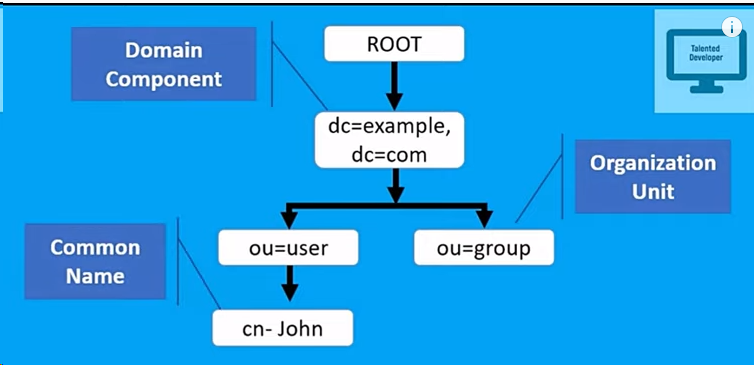
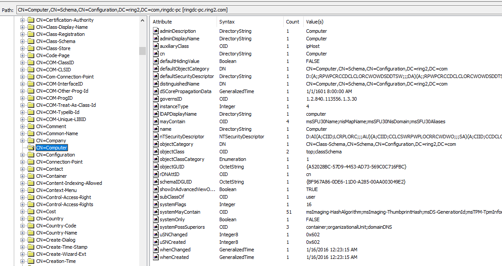
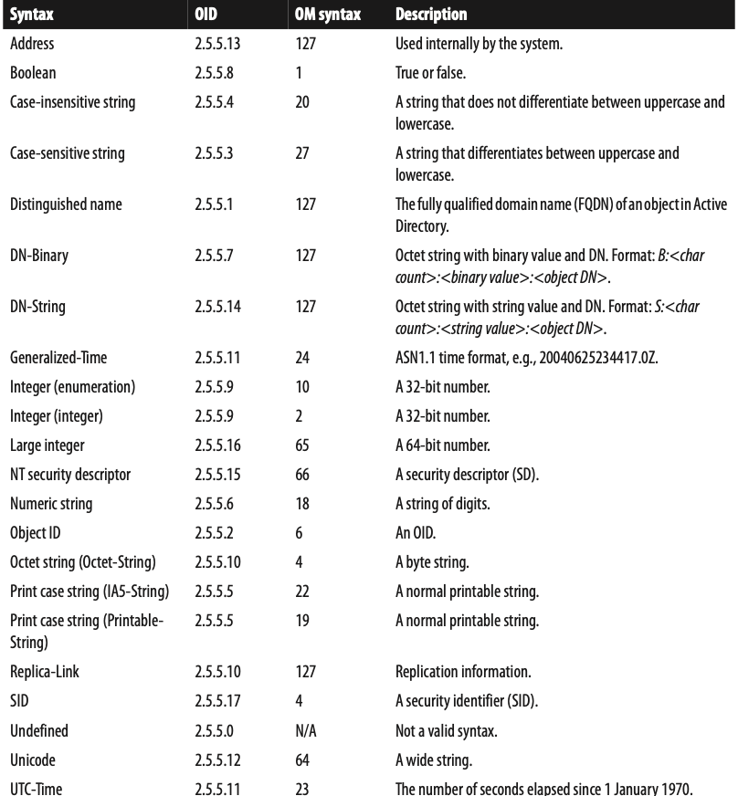
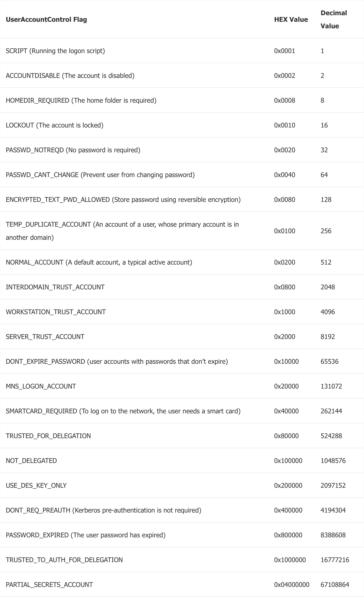
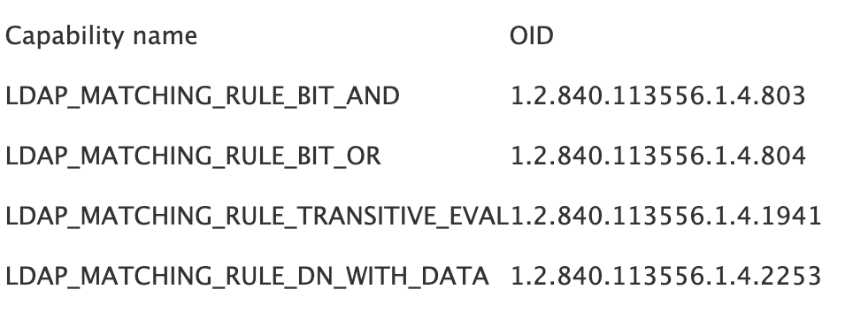
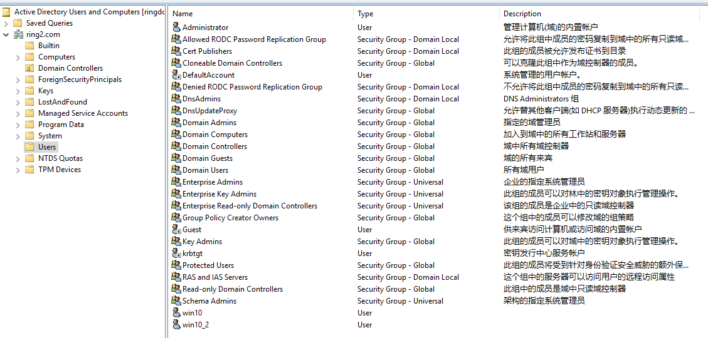
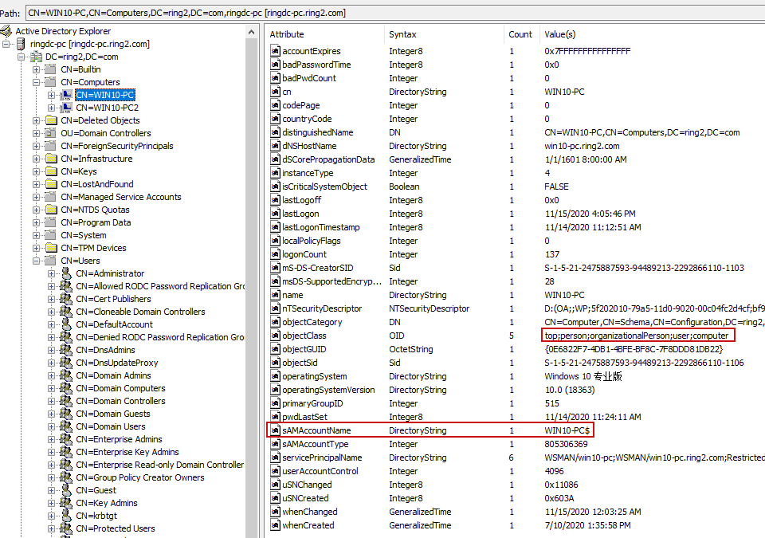
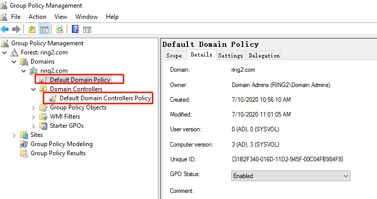
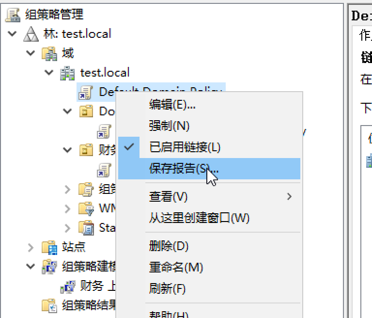

## LDAP与AD

LDAP: Lightweight Directory Access Protocol, 轻量级目录访问协议。协议只是一套抽象的标准，Windows AD就是基于LDAP协议实现的一套应用，用于提供域环境中用户及用户组的管理与认证。

AD由目录服务数据库+一套访问协议组成: 它是一个树形数据库，适合用来存储不需要经常更改、需要快速查找的数据。同时，AD还是一个LDAP服务端，供client连接、查询、以及其他操作。


LDAP结构和常用术语如下：

一条路径上的dc, ou, cn组合起来成为dn，能唯一标识一条记录位置。




## [Naming Context](https://en.wikipedia.org/wiki/Naming_Context)

AD使用NC将不同类型的数据归为不同的分区，Domain Controllers之间同步数据也是按照NC单独同步。

Active Directory can support tens of millions of objects. To scale up those objects, the Active Directory database is divided up into partitions for replication and administration. Each logical partition replicates its changes separately among domain controllers in the forest.

By default, the Active Directory Domain Service contains the following naming contexts:

- Schema NC: stores schema information that is replicated to domain controllers in all domains of the forest. 
- Configuration NC: stores configuration data information that is replicated to domain controllers in all domains of the forest.
- Domain NC: store domain information such as users and computers that is replicated to domain controllers in that domain only.

使用AD自带的ADSI Edit或SysinternalsSuite中的ADExplorer.exe均可查看3个NC中的内容。


### Schema NC

Schema NC存储了类、属性的Schema信息，以Domain NC中 `CN=WIN10-PC,CN=Computers,DC=ring2,DC=com`为例，它是Computer类的一个实例。在Schema NC里可以看到它有哪些属性。



NC中每一个条目都是一个实例，这里的`CN=Computer,CN=Schema,CN=Configuration,DC=ring2,DC=com,ringdc-pc [ringdc-pc.ring2.com]`既描述了computer类的信息，它本身也是一个classSchema类的实例。

- defaultObjectCategory:  指定类实例的ObjectCategory的值，defaultObjectCategory值并不唯一，例如person类、user类的defaultObjectCategory都是`CN=Person,CN=Schema,CN=Configuration,DC=ring2,DC=com`
- objectCategory: 此实例所属类设置的defaultObjectCategory，这里是classSchema类
- objectClass： 此实例所属类及所有父类的lDAPDisplayName
- lDAPDisplayName： 用于对objectCategory做检索时使用
- subClassof : 父类的lDAPDisplayName


AD中的属性在Schema NC中也有对应的条目，以Comment属性为例:


依据上图中attributeSyntax和oMSntax的值，查询下表，可以知道comments是一个unicode string。




### Configuration NC

存储配置信息，比如DCSync中用到的DS-Replication-Get-Changes-All Extended Rights


## LDAP查询

https://knowledge.broadcom.com/external/article/164552/how-to-set-up-ldap-filter-for-nested-gro.html (Filter语法、常用查询语句)

- (uid=testuser)

匹配 uid 属性为testuser的所有对象

- (uid=test*)

匹配 uid 属性以test开头的所有对象

- (!(uid=test*))

匹配 uid 属性不以test开头的所有对象

- (&(department=1234)(city=Paris))

匹配 department 属性为1234且city属性为Paris的所有对象

- (|(department=1234)(department=56*))

匹配 department 属性的值刚好为1234或者以56开头的所有对象。


除此之外，经常在powerview.ps1等工具里看到以下查询命令 `userAccountControl:1.2.840.113556.1.4.803:=65536`，这个是LDAP的高级用法，位掩码查询。`userAccountControl`是一个32 bit值，对应的位字段含义如下:




要按位过滤，使用以下语法

```
<属性名称>：<BitFilterRule-ID> := <十进制比较值>
```

其中的`<BitFilterRule-ID>`，内容如下




### objectCategory 与 objectClass

1. objectClass是一个多值属性，比如说`CN=jane,CN=Users,DC=test,DC=local`的`objectClass`是`top,person,organizationalPerson,user`。那我们通过过滤语句`(objectClass=user)`,`(objectClass=organizationalPerson)`都能找到这个对象。

2. 使用objectCategory过滤，可以用lDAPDisplayName简化查询。

   `(objectCategory=cn=person,cn=Schema,cn=Configuration,dc=MyDomain,dc=com)`

   简化为:

   `(objectCategory=person)`

3. Windows Server 2008之前默认不对objectClass 属性进行索引，所以一般先用objectCategory划出一个大范围，再用objectClass精确到小范围。

   `(&(objectCategory=person)(objectClass=user))`

   如果在目录中已经索引了ObjectClass ，或者所有域控制器都在运行Windows Server 2008或更高版本，则不用考虑效率问题。


### SAMR 协议查询

除了使用LDAP查询域用户、用户组，还可以使用SAMR协议查询。以下命令就是基于SAMR实现的

```
net user /domain
net group /domain
```


## 组 group

所有的组都是`group`类的实例，可以用`(objectClass=group)`或者`(objectCategory=group)`来过滤组。按照用途来分，分为通讯组和安全组，我们常接触的Domain Admins, Administrators就是安全组，安全组就是一组权限的集合。

group和OU的区别是，group是管理者的集合，OU是被管理者的集合。

安全组分以下三类:

- 全局组 (Global group)

- 通用组(Universal group)

- 域本地组(Domain Local group)





## 机器用户

computer类是user类的子类，机器用户其实就是一个域用户，其用户名是`机器名$`



## 组策略 

`gpmc.msc` 打开组策略管理






## 参考

https://daiker.gitbook.io/windows-protocol/ldap-pian/8

