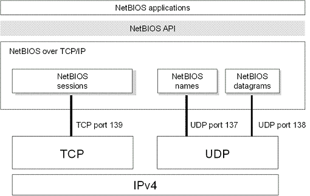
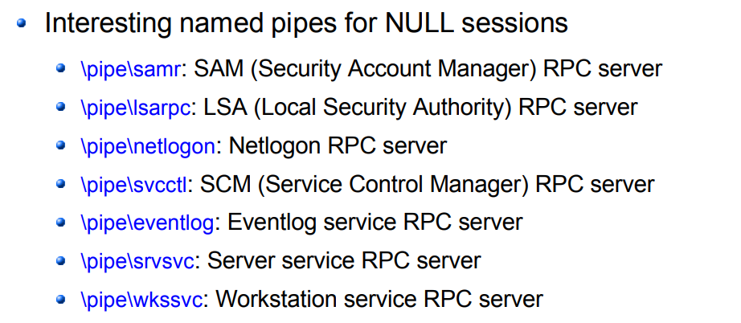

# Windows基础-SMB协议与IPC$

## SMB协议

[NetBios, NetBios over TCP/IP, SMB 之间的关系](https://www.cnblogs.com/pipci/p/10144840.html)

https://en.wikipedia.org/wiki/Server_Message_Block

在计算机网络中，SMB协议是一种通信协议，用于提供文件共享，文件打印，以及带身份验证的进程间通信机制。SMB协议是客户端-服务器模式，SMB协议的主要涉及两部分功能：

- 一部分专门涉及对文件系统的访问，以便客户端可以向文件服务器发出请求；

- 另一部分专门研究进程间通信（IPC）

  Windows上IPC$就是此部分的一个典型应用。

  *我的理解：命名管道(named pipes)、socket、shared memory是实现进程间通信的三种方式，IPC$是基于named pipes，named pipes是基于SMB协议的；IPC,RPC是一个东西*

  

SMB协议是运行在会话层之上的网络层协议，有两种运行方式 ：

- 第一种通过NetBios API，使用的是UDP的137和138端口以及TCP的137和139的端口。

  如今，我们使用的网络协议栈是TCP/IP协议栈，在Windows操作系统上，NetBios运行在NetBios over TCP/IP的协议上，NetBios over TCP/IP（简称NBT或者NetBT）是一个网络协议，允许以前使用NetBios API的应用程序能够在现代的TCP/IP网络中。如下图：

  

- 第二种是直接运行在TCP和UDP协议之上，使用的是445端口，可以称为"Direct hosting of SMB over TCP/IP"。

## IPC$

[An Introduction to SMB for Network Security Analysts](https://401trg.com/an-introduction-to-smb-for-network-security-analysts/)

[Abusing Windows Admin Shares (Lateral Movement)](https://www.youtube.com/watch?v=41MUhlHGZ4E&t=323s)

To begin an SMB session, the two participants agree on a dialect, authentication is performed, and the initiator connects to a ‘tree.’ For most intents and purposes, the tree can be thought of as a network share.

Windows默认会开启3类network share，使用`net share`或`net view \\pc-name /all`可以查看：

1. c$, d$... 文件共享，对应本机C盘，D盘
2. ADMIN$ 文件共享，对应本机C:\Windows
3. IPC$，RPC接口、可以理解为一组named pipes server的入口

### SAMR

### atsvc

## PSEXEC

[An Introduction to SMB for Network Security Analysts](https://401trg.com/an-introduction-to-smb-for-network-security-analysts/)